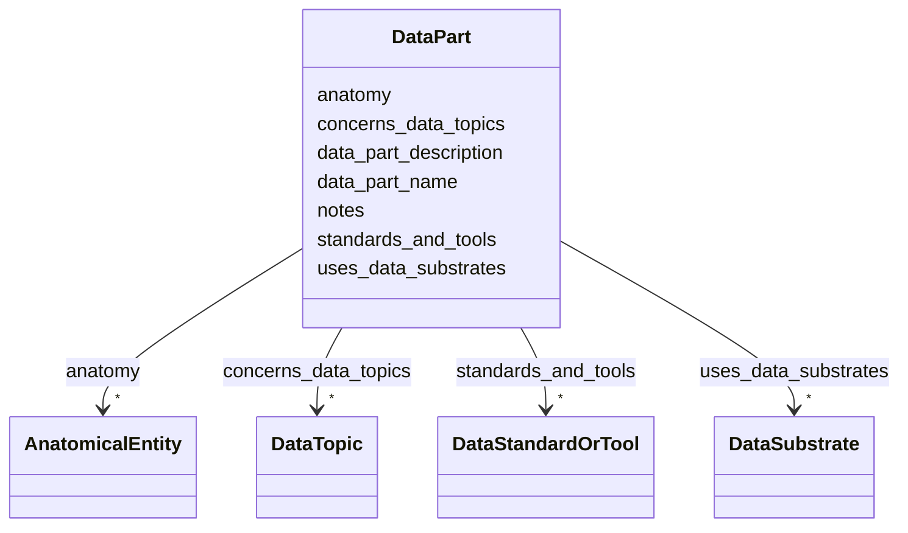

# Class: DataPart 


_Represents a part of all datasets in a manifest. This may be a file, table, or other component. It does not have to be associated with a single dataset, but represents a general type of data produced by the organization._


URI: [https://w3id.org/bridge2ai/standards-schema-all/DataPart](https://w3id.org/bridge2ai/standards-schema-all/DataPart)





<!-- no inheritance hierarchy -->


## Slots

| Name | Cardinality and Range | Description | Inheritance |
| ---  | --- | --- | --- |
| [data_part_name](data_part_name.md) | 0..1 <br/> [String](String.md) | Name of the data part | direct |
| [data_part_description](data_part_description.md) | 0..1 <br/> [String](String.md) | Description of the data part | direct |
| [standards_and_tools](standards_and_tools.md) | * <br/> [DataStandardOrTool](DataStandardOrTool.md) | The data part includes these standards and tools | direct |
| [uses_data_substrates](uses_data_substrates.md) | * <br/> [DataSubstrate](DataSubstrate.md) | The data part includes these data substrates | direct |
| [concerns_data_topics](concerns_data_topics.md) | * <br/> [DataTopic](DataTopic.md) | The data part includes these data topics | direct |
| [anatomy](anatomy.md) | * <br/> [AnatomicalEntity](AnatomicalEntity.md) | Relevant anatomical locations, including gross anatomical parts, cell types, ... | direct |
| [notes](notes.md) | 0..1 <br/> [String](String.md) | Any additional notes about the manifest or the data part | direct |


## Usages

| used by | used in | type | used |
| ---  | --- | --- | --- |
| [Manifest](Manifest.md) | [data_parts](data_parts.md) | range | [DataPart](DataPart.md) |
| [DataPart](DataPart.md) | [standards_and_tools](standards_and_tools.md) | domain | [DataPart](DataPart.md) |
| [DataPart](DataPart.md) | [uses_data_substrates](uses_data_substrates.md) | domain | [DataPart](DataPart.md) |
| [DataPart](DataPart.md) | [concerns_data_topics](concerns_data_topics.md) | domain | [DataPart](DataPart.md) |


## Identifier and Mapping Information


### Schema Source


* from schema: https://w3id.org/bridge2ai/standards-schema-all


## Mappings

| Mapping Type | Mapped Value |
| ---  | ---  |
| self | https://w3id.org/bridge2ai/standards-schema-all/DataPart |
| native | https://w3id.org/bridge2ai/standards-schema-all/DataPart |


## LinkML Source

<!-- TODO: investigate https://stackoverflow.com/questions/37606292/how-to-create-tabbed-code-blocks-in-mkdocs-or-sphinx -->

### Direct

<details>
```yaml
name: DataPart
description: Represents a part of all datasets in a manifest. This may be a file,
  table, or other component. It does not have to be associated with a single dataset,
  but represents a general type of data produced by the organization.
from_schema: https://w3id.org/bridge2ai/standards-schema-all
slots:
- data_part_name
- data_part_description
- standards_and_tools
- uses_data_substrates
- concerns_data_topics
- anatomy
- notes

```
</details>

### Induced

<details>
```yaml
name: DataPart
description: Represents a part of all datasets in a manifest. This may be a file,
  table, or other component. It does not have to be associated with a single dataset,
  but represents a general type of data produced by the organization.
from_schema: https://w3id.org/bridge2ai/standards-schema-all
attributes:
  data_part_name:
    name: data_part_name
    description: Name of the data part.
    from_schema: https://w3id.org/bridge2ai/standards-schema-all
    rank: 1000
    alias: data_part_name
    owner: DataPart
    domain_of:
    - DataPart
    range: string
  data_part_description:
    name: data_part_description
    description: Description of the data part.
    from_schema: https://w3id.org/bridge2ai/standards-schema-all
    rank: 1000
    alias: data_part_description
    owner: DataPart
    domain_of:
    - DataPart
    range: string
  standards_and_tools:
    name: standards_and_tools
    description: The data part includes these standards and tools. Must be a list
      of StandardOrTool objects, referenced with their B2AI_STANDARD IDs.
    from_schema: https://w3id.org/bridge2ai/standards-schema-all
    rank: 1000
    is_a: related_to
    domain: DataPart
    inherited: true
    alias: standards_and_tools
    owner: DataPart
    domain_of:
    - DataPart
    range: DataStandardOrTool
    multivalued: true
  uses_data_substrates:
    name: uses_data_substrates
    description: The data part includes these data substrates. Must be a list of DataSubstrate
      objects, referenced with their B2AI_SUBSTRATE IDs.
    from_schema: https://w3id.org/bridge2ai/standards-schema-all
    rank: 1000
    is_a: related_to
    domain: DataPart
    inherited: true
    alias: uses_data_substrates
    owner: DataPart
    domain_of:
    - DataPart
    range: DataSubstrate
    multivalued: true
  concerns_data_topics:
    name: concerns_data_topics
    description: The data part includes these data topics. Must be a list of DataTopic
      objects, referenced with their B2AI_TOPIC IDs.
    from_schema: https://w3id.org/bridge2ai/standards-schema-all
    rank: 1000
    is_a: related_to
    domain: DataPart
    inherited: true
    alias: concerns_data_topics
    owner: DataPart
    domain_of:
    - DataPart
    range: DataTopic
    multivalued: true
  anatomy:
    name: anatomy
    description: Relevant anatomical locations, including gross anatomical parts,
      cell types, and subcellular locations.
    from_schema: https://w3id.org/bridge2ai/standards-schema-all
    rank: 1000
    is_a: node_property
    domain: NamedThing
    alias: anatomy
    owner: DataPart
    domain_of:
    - DataPart
    range: AnatomicalEntity
    multivalued: true
  notes:
    name: notes
    description: Any additional notes about the manifest or the data part.
    from_schema: https://w3id.org/bridge2ai/standards-schema-all
    rank: 1000
    is_a: node_property
    domain: NamedThing
    alias: notes
    owner: DataPart
    domain_of:
    - Manifest
    - DataPart
    range: string

```
</details>