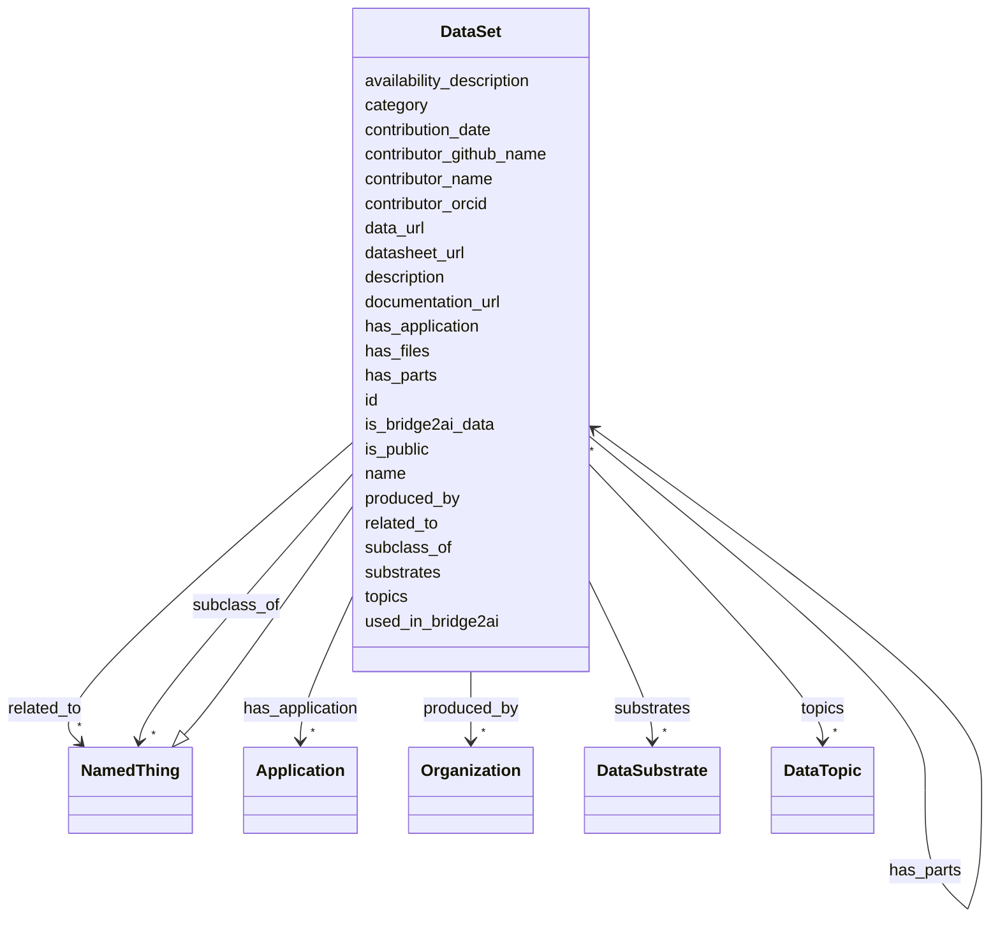

# Class: DataSet 


_Represents a data set by its metadata. This may or may not be produced by a group in the Bridge2AI consortium._


URI: [https://w3id.org/bridge2ai/standards-schema-all/DataSet](https://w3id.org/bridge2ai/standards-schema-all/DataSet)





## Inheritance
* [NamedThing](NamedThing.md)
    * **DataSet**


## Slots

| Name | Cardinality and Range | Description | Inheritance |
| ---  | --- | --- | --- |
| [has_files](has_files.md) | * <br/> [String](String.md) | Subject data set has the file(s) listed in this slot as parts | direct |
| [has_parts](has_parts.md) | * <br/> [DataSet](DataSet.md) | Subject data set has the data set(s) listed in this slot as parts | direct |
| [produced_by](produced_by.md) | * <br/> [Organization](Organization.md) | Subject data set was produced by the organization(s) listed in this slot | direct |
| [data_url](data_url.md) | 0..1 <br/> [Uriorcurie](Uriorcurie.md) | URL where the data set can be accessed | direct |
| [documentation_url](documentation_url.md) | 0..1 <br/> [Uriorcurie](Uriorcurie.md) | URL where documentation for the data set can be accessed | direct |
| [datasheet_url](datasheet_url.md) | 0..1 <br/> [Uriorcurie](Uriorcurie.md) | URL where the datasheet for the data set can be accessed | direct |
| [is_public](is_public.md) | 0..1 <br/> [Boolean](Boolean.md) | True if the data set is publicly available | direct |
| [substrates](substrates.md) | * <br/> [DataSubstrate](DataSubstrate.md) | Subject data set is relevant to the substrate(s) listed in this slot | direct |
| [topics](topics.md) | * <br/> [DataTopic](DataTopic.md) | Subject data set is relevant to the topic(s) listed in this slot | direct |
| [is_bridge2ai_data](is_bridge2ai_data.md) | 0..1 <br/> [Boolean](Boolean.md) | True if the data set is produced by a Bridge2AI consortium group | direct |
| [availability_description](availability_description.md) | 0..1 <br/> [String](String.md) | A description of the availability of the data set, including any restrictions... | direct |
| [id](id.md) | 1 <br/> [Uriorcurie](Uriorcurie.md) | A unique identifier for a thing | [NamedThing](NamedThing.md) |
| [category](category.md) | 0..1 <br/> [CategoryType](CategoryType.md) | CURIE for the high level ontology class in which this entity is categorized | [NamedThing](NamedThing.md) |
| [name](name.md) | 0..1 <br/> [String](String.md) | A human-readable name for a thing | [NamedThing](NamedThing.md) |
| [description](description.md) | 0..1 <br/> [String](String.md) | A human-readable description for a thing | [NamedThing](NamedThing.md) |
| [subclass_of](subclass_of.md) | * <br/> [NamedThing](NamedThing.md) | Holds between two classes where the domain class is a specialization of the r... | [NamedThing](NamedThing.md) |
| [related_to](related_to.md) | * <br/> [NamedThing](NamedThing.md) | A relationship that is asserted between two named things | [NamedThing](NamedThing.md) |
| [contributor_name](contributor_name.md) | 0..1 <br/> [String](String.md) | The name of the person who added this node | [NamedThing](NamedThing.md) |
| [contributor_github_name](contributor_github_name.md) | 0..1 <br/> [String](String.md) | The name of the github user who added this node | [NamedThing](NamedThing.md) |
| [contributor_orcid](contributor_orcid.md) | 0..1 <br/> [Uriorcurie](Uriorcurie.md) | The ORCiD of the person who added this node | [NamedThing](NamedThing.md) |
| [contribution_date](contribution_date.md) | 0..1 <br/> [Date](Date.md) | The date on which the node was added | [NamedThing](NamedThing.md) |
| [used_in_bridge2ai](used_in_bridge2ai.md) | 0..1 <br/> [Boolean](Boolean.md) | True if the entity is used, developed, or otherwise related to work in the Br... | [NamedThing](NamedThing.md) |
| [has_application](has_application.md) | * <br/> [Application](Application.md) | A list of one or more specific applications of this entity to a specific purp... | [NamedThing](NamedThing.md) |


## Usages

| used by | used in | type | used |
| ---  | --- | --- | --- |
| [DataSet](DataSet.md) | [has_files](has_files.md) | domain | [DataSet](DataSet.md) |
| [DataSet](DataSet.md) | [has_parts](has_parts.md) | domain | [DataSet](DataSet.md) |
| [DataSet](DataSet.md) | [has_parts](has_parts.md) | range | [DataSet](DataSet.md) |
| [DataSet](DataSet.md) | [produced_by](produced_by.md) | domain | [DataSet](DataSet.md) |
| [DataSet](DataSet.md) | [data_url](data_url.md) | domain | [DataSet](DataSet.md) |
| [DataSet](DataSet.md) | [documentation_url](documentation_url.md) | domain | [DataSet](DataSet.md) |
| [DataSet](DataSet.md) | [datasheet_url](datasheet_url.md) | domain | [DataSet](DataSet.md) |
| [DataSet](DataSet.md) | [is_public](is_public.md) | domain | [DataSet](DataSet.md) |
| [DataSet](DataSet.md) | [substrates](substrates.md) | domain | [DataSet](DataSet.md) |
| [DataSet](DataSet.md) | [topics](topics.md) | domain | [DataSet](DataSet.md) |
| [DataSet](DataSet.md) | [is_bridge2ai_data](is_bridge2ai_data.md) | domain | [DataSet](DataSet.md) |
| [DataSet](DataSet.md) | [availability_description](availability_description.md) | domain | [DataSet](DataSet.md) |
| [DataSetContainer](DataSetContainer.md) | [data_collection](data_collection.md) | range | [DataSet](DataSet.md) |
| [Manifest](Manifest.md) | [datasets](datasets.md) | range | [DataSet](DataSet.md) |


## Identifier and Mapping Information


### Schema Source


* from schema: https://w3id.org/bridge2ai/standards-schema-all


## Mappings

| Mapping Type | Mapped Value |
| ---  | ---  |
| self | https://w3id.org/bridge2ai/standards-schema-all/DataSet |
| native | https://w3id.org/bridge2ai/standards-schema-all/DataSet |


## LinkML Source

<!-- TODO: investigate https://stackoverflow.com/questions/37606292/how-to-create-tabbed-code-blocks-in-mkdocs-or-sphinx -->

### Direct

<details>
```yaml
name: DataSet
description: Represents a data set by its metadata. This may or may not be produced
  by a group in the Bridge2AI consortium.
from_schema: https://w3id.org/bridge2ai/standards-schema-all
is_a: NamedThing
slots:
- has_files
- has_parts
- produced_by
- data_url
- documentation_url
- datasheet_url
- is_public
- substrates
- topics
- is_bridge2ai_data
- availability_description

```
</details>

### Induced

<details>
```yaml
name: DataSet
description: Represents a data set by its metadata. This may or may not be produced
  by a group in the Bridge2AI consortium.
from_schema: https://w3id.org/bridge2ai/standards-schema-all
is_a: NamedThing
attributes:
  has_files:
    name: has_files
    description: Subject data set has the file(s) listed in this slot as parts. Note
      that each file is not a data set and does not have its own ID in the registry.
      For data sets that are parts of this data set, use the `has_parts` slot.
    from_schema: https://w3id.org/bridge2ai/standards-schema-all
    rank: 1000
    is_a: related_to
    domain: DataSet
    inherited: true
    alias: has_files
    owner: DataSet
    domain_of:
    - DataSet
    range: string
    multivalued: true
  has_parts:
    name: has_parts
    description: Subject data set has the data set(s) listed in this slot as parts.
      Note that each part is itself a data set, with its own ID in the registry. For
      specific files, use the `has_files` slot.
    from_schema: https://w3id.org/bridge2ai/standards-schema-all
    rank: 1000
    is_a: related_to
    domain: DataSet
    inherited: true
    alias: has_parts
    owner: DataSet
    domain_of:
    - DataSet
    range: DataSet
    multivalued: true
  produced_by:
    name: produced_by
    description: Subject data set was produced by the organization(s) listed in this
      slot. Must be an Organization object, referenced with its B2AI_ORG ID.
    from_schema: https://w3id.org/bridge2ai/standards-schema-all
    rank: 1000
    is_a: related_to
    domain: DataSet
    inherited: true
    alias: produced_by
    owner: DataSet
    domain_of:
    - DataSet
    range: Organization
    multivalued: true
  data_url:
    name: data_url
    description: URL where the data set can be accessed.
    from_schema: https://w3id.org/bridge2ai/standards-schema-all
    rank: 1000
    is_a: node_property
    domain: DataSet
    alias: data_url
    owner: DataSet
    domain_of:
    - DataSet
    range: uriorcurie
  documentation_url:
    name: documentation_url
    description: URL where documentation for the data set can be accessed.
    from_schema: https://w3id.org/bridge2ai/standards-schema-all
    rank: 1000
    is_a: node_property
    domain: DataSet
    alias: documentation_url
    owner: DataSet
    domain_of:
    - DataSet
    range: uriorcurie
  datasheet_url:
    name: datasheet_url
    description: URL where the datasheet for the data set can be accessed.
    from_schema: https://w3id.org/bridge2ai/standards-schema-all
    rank: 1000
    is_a: node_property
    domain: DataSet
    alias: datasheet_url
    owner: DataSet
    domain_of:
    - DataSet
    range: uriorcurie
  is_public:
    name: is_public
    description: True if the data set is publicly available. False if the data set
      is private or requires special permissions to access.
    from_schema: https://w3id.org/bridge2ai/standards-schema-all
    rank: 1000
    is_a: node_property
    domain: DataSet
    alias: is_public
    owner: DataSet
    domain_of:
    - DataSet
    range: boolean
  substrates:
    name: substrates
    description: Subject data set is relevant to the substrate(s) listed in this slot.
      Must be a DataSubstrate object, referenced with its B2AI_SUBSTRATE ID.
    from_schema: https://w3id.org/bridge2ai/standards-schema-all
    rank: 1000
    is_a: related_to
    domain: DataSet
    inherited: true
    alias: substrates
    owner: DataSet
    domain_of:
    - DataSet
    range: DataSubstrate
    multivalued: true
  topics:
    name: topics
    description: Subject data set is relevant to the topic(s) listed in this slot.
      Must be a DataTopic object, referenced with its B2AI_TOPIC ID.
    from_schema: https://w3id.org/bridge2ai/standards-schema-all
    rank: 1000
    is_a: related_to
    domain: DataSet
    inherited: true
    alias: topics
    owner: DataSet
    domain_of:
    - DataSet
    range: DataTopic
    multivalued: true
  is_bridge2ai_data:
    name: is_bridge2ai_data
    description: True if the data set is produced by a Bridge2AI consortium group.
      False if the data set is not produced by a Bridge2AI consortium group.
    from_schema: https://w3id.org/bridge2ai/standards-schema-all
    rank: 1000
    is_a: node_property
    domain: DataSet
    alias: is_bridge2ai_data
    owner: DataSet
    domain_of:
    - DataSet
    range: boolean
    required: false
  availability_description:
    name: availability_description
    description: A description of the availability of the data set, including any
      restrictions on access or use.
    examples:
    - value: '"Datasets require additional permissions. Please visit https://example.com
        for more information."'
    from_schema: https://w3id.org/bridge2ai/standards-schema-all
    rank: 1000
    is_a: node_property
    domain: DataSet
    alias: availability_description
    owner: DataSet
    domain_of:
    - DataSet
    range: string
    required: false
  id:
    name: id
    description: A unique identifier for a thing.
    from_schema: https://w3id.org/bridge2ai/standards-schema-all
    rank: 1000
    slot_uri: schema:identifier
    identifier: true
    alias: id
    owner: DataSet
    domain_of:
    - NamedThing
    range: uriorcurie
    required: true
  category:
    name: category
    description: CURIE for the high level ontology class in which this entity is categorized.
      Corresponds to the label for the entity type class, e.g., "B2AI_STANDARD:DataStandard".
    from_schema: https://w3id.org/bridge2ai/standards-schema-all
    rank: 1000
    is_a: type
    domain: NamedThing
    designates_type: true
    alias: category
    owner: DataSet
    domain_of:
    - NamedThing
    range: category_type
  name:
    name: name
    description: A human-readable name for a thing.
    from_schema: https://w3id.org/bridge2ai/standards-schema-all
    rank: 1000
    slot_uri: schema:name
    alias: name
    owner: DataSet
    domain_of:
    - NamedThing
    range: string
  description:
    name: description
    description: A human-readable description for a thing.
    from_schema: https://w3id.org/bridge2ai/standards-schema-all
    rank: 1000
    slot_uri: schema:description
    alias: description
    owner: DataSet
    domain_of:
    - NamedThing
    range: string
  subclass_of:
    name: subclass_of
    description: Holds between two classes where the domain class is a specialization
      of the range class.
    from_schema: https://w3id.org/bridge2ai/standards-schema-all
    exact_mappings:
    - rdfs:subClassOf
    - MESH:isa
    narrow_mappings:
    - rdfs:subPropertyOf
    rank: 1000
    is_a: related_to
    domain: NamedThing
    inherited: true
    alias: subclass_of
    owner: DataSet
    domain_of:
    - NamedThing
    range: NamedThing
    multivalued: true
  related_to:
    name: related_to
    description: A relationship that is asserted between two named things.
    from_schema: https://w3id.org/bridge2ai/standards-schema-all
    rank: 1000
    domain: NamedThing
    inherited: true
    alias: related_to
    owner: DataSet
    domain_of:
    - NamedThing
    - Organization
    symmetric: true
    range: NamedThing
    multivalued: true
  contributor_name:
    name: contributor_name
    description: The name of the person who added this node.
    from_schema: https://w3id.org/bridge2ai/standards-schema-all
    rank: 1000
    is_a: node_property
    domain: NamedThing
    alias: contributor_name
    owner: DataSet
    domain_of:
    - NamedThing
    range: string
  contributor_github_name:
    name: contributor_github_name
    description: The name of the github user who added this node.
    from_schema: https://w3id.org/bridge2ai/standards-schema-all
    rank: 1000
    is_a: node_property
    domain: NamedThing
    alias: contributor_github_name
    owner: DataSet
    domain_of:
    - NamedThing
    range: string
  contributor_orcid:
    name: contributor_orcid
    description: The ORCiD of the person who added this node.
    examples:
    - value: ORCID:0000-0001-1234-5678
    from_schema: https://w3id.org/bridge2ai/standards-schema-all
    rank: 1000
    is_a: node_property
    domain: NamedThing
    alias: contributor_orcid
    owner: DataSet
    domain_of:
    - NamedThing
    range: uriorcurie
  contribution_date:
    name: contribution_date
    description: The date on which the node was added.
    examples:
    - value: '2023-03-20'
    from_schema: https://w3id.org/bridge2ai/standards-schema-all
    rank: 1000
    is_a: node_property
    domain: NamedThing
    alias: contribution_date
    owner: DataSet
    domain_of:
    - NamedThing
    range: date
  used_in_bridge2ai:
    name: used_in_bridge2ai
    description: True if the entity is used, developed, or otherwise related to work
      in the Bridge2AI consortium. If false, the entity is not explicitly related
      to Bridge2AI. If not specified, it is not known if the entity is related to
      Bridge2AI.
    from_schema: https://w3id.org/bridge2ai/standards-schema-all
    rank: 1000
    is_a: node_property
    domain: NamedThing
    alias: used_in_bridge2ai
    owner: DataSet
    domain_of:
    - NamedThing
    range: boolean
  has_application:
    name: has_application
    description: A list of one or more specific applications of this entity to a specific
      purpose.
    from_schema: https://w3id.org/bridge2ai/standards-schema-all
    rank: 1000
    domain: NamedThing
    alias: has_application
    owner: DataSet
    domain_of:
    - NamedThing
    range: Application
    multivalued: true
    inlined: true
    inlined_as_list: true

```
</details>