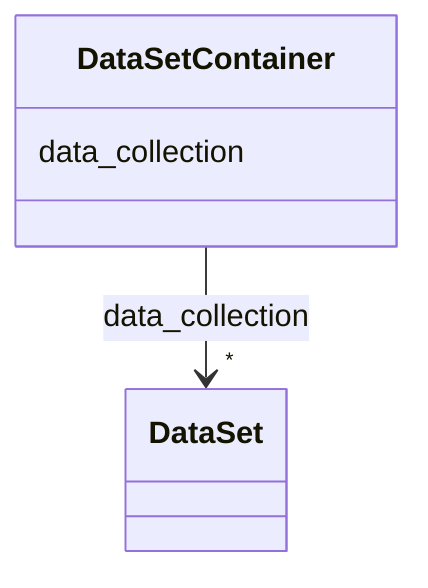

# Class: DataSetContainer


_A container for DataSets._


URI: [https://w3id.org/bridge2ai/standards-schema-all/:DataSetContainer](https://w3id.org/bridge2ai/standards-schema-all/:DataSetContainer)





<!-- no inheritance hierarchy -->


## Slots

| Name | Cardinality and Range | Description | Inheritance |
| ---  | --- | --- | --- |
| [data_collection](data_collection.md) | * <br/> [DataSet](DataSet.md) | Collection of associated DataSet objects | direct |


## Identifier and Mapping Information


### Schema Source


* from schema: https://w3id.org/bridge2ai/standards-schema-all


## Mappings

| Mapping Type | Mapped Value |
| ---  | ---  |
| self | https://w3id.org/bridge2ai/standards-schema-all/:DataSetContainer |
| native | https://w3id.org/bridge2ai/standards-schema-all/:DataSetContainer |


## LinkML Source

<!-- TODO: investigate https://stackoverflow.com/questions/37606292/how-to-create-tabbed-code-blocks-in-mkdocs-or-sphinx -->

### Direct

<details>
```yaml
name: DataSetContainer
description: A container for DataSets.
from_schema: https://w3id.org/bridge2ai/standards-schema-all
slots:
- data_collection

```
</details>

### Induced

<details>
```yaml
name: DataSetContainer
description: A container for DataSets.
from_schema: https://w3id.org/bridge2ai/standards-schema-all
attributes:
  data_collection:
    name: data_collection
    description: Collection of associated DataSet objects.
    from_schema: https://w3id.org/bridge2ai/standards-schema-all
    rank: 1000
    alias: data_collection
    owner: DataSetContainer
    domain_of:
    - DataSetContainer
    range: DataSet
    multivalued: true
    inlined: true
    inlined_as_list: true

```
</details>