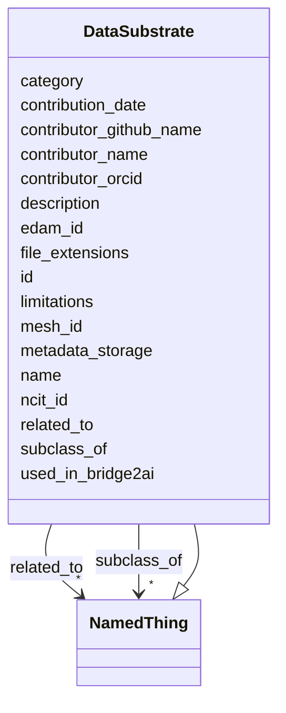

# Class: DataSubstrate 


_Represents a data substrate for Bridge2AI data. This may be a high-level data structure or a specific implementation of that structure. Interpret as "data, in this form or format", as compared to DataStandard, which refers to the set of rules defining a standard. For example, data in TSV format is represented as a DataSubstrate but the concept of TSV format is a DataStandard._


URI: [https://w3id.org/bridge2ai/standards-schema-all/DataSubstrate](https://w3id.org/bridge2ai/standards-schema-all/DataSubstrate)





## Inheritance
* [NamedThing](NamedThing.md)
    * **DataSubstrate**


## Slots

| Name | Cardinality and Range | Description | Inheritance |
| ---  | --- | --- | --- |
| [edam_id](edam_id.md) | 0..1 <br/> [EdamIdentifier](EdamIdentifier.md) | Unique EDAM identifier | direct |
| [mesh_id](mesh_id.md) | 0..1 <br/> [MeshIdentifier](MeshIdentifier.md) | Unique MeSH identifier | direct |
| [ncit_id](ncit_id.md) | 0..1 <br/> [NcitIdentifier](NcitIdentifier.md) | Unique NCIt Identifier | direct |
| [metadata_storage](metadata_storage.md) | * <br/> [String](String.md)&nbsp;or&nbsp;<br />[DataSubstrate](DataSubstrate.md) | Data Substrate in which metadata is stored | direct |
| [file_extensions](file_extensions.md) | * <br/> [String](String.md) | Commonly used file extensions for this substrate | direct |
| [limitations](limitations.md) | * <br/> [String](String.md) | Potential obstacles particular to this substrate or implementation | direct |
| [id](id.md) | 1 <br/> [Uriorcurie](Uriorcurie.md) | A unique identifier for a thing | [NamedThing](NamedThing.md) |
| [category](category.md) | 0..1 <br/> [CategoryType](CategoryType.md) | CURIE for the high level ontology class in which this entity is categorized | [NamedThing](NamedThing.md) |
| [name](name.md) | 0..1 <br/> [String](String.md) | A human-readable name for a thing | [NamedThing](NamedThing.md) |
| [description](description.md) | 0..1 <br/> [String](String.md) | A human-readable description for a thing | [NamedThing](NamedThing.md) |
| [subclass_of](subclass_of.md) | * <br/> [NamedThing](NamedThing.md) | Holds between two classes where the domain class is a specialization of the r... | [NamedThing](NamedThing.md) |
| [related_to](related_to.md) | * <br/> [NamedThing](NamedThing.md) | A relationship that is asserted between two named things | [NamedThing](NamedThing.md) |
| [contributor_name](contributor_name.md) | 0..1 <br/> [String](String.md) | The name of the person who added this node | [NamedThing](NamedThing.md) |
| [contributor_github_name](contributor_github_name.md) | 0..1 <br/> [String](String.md) | The name of the github user who added this node | [NamedThing](NamedThing.md) |
| [contributor_orcid](contributor_orcid.md) | 0..1 <br/> [Uriorcurie](Uriorcurie.md) | The ORCiD of the person who added this node | [NamedThing](NamedThing.md) |
| [contribution_date](contribution_date.md) | 0..1 <br/> [Date](Date.md) | The date on which the node was added | [NamedThing](NamedThing.md) |
| [used_in_bridge2ai](used_in_bridge2ai.md) | 0..1 <br/> [Boolean](Boolean.md) | True if the entity is used, developed, or otherwise related to work in the Br... | [NamedThing](NamedThing.md) |


## Usages

| used by | used in | type | used |
| ---  | --- | --- | --- |
| [DataStandardOrTool](DataStandardOrTool.md) | [has_relevant_data_substrate](has_relevant_data_substrate.md) | range | [DataSubstrate](DataSubstrate.md) |
| [DataStandard](DataStandard.md) | [has_relevant_data_substrate](has_relevant_data_substrate.md) | range | [DataSubstrate](DataSubstrate.md) |
| [BiomedicalStandard](BiomedicalStandard.md) | [has_relevant_data_substrate](has_relevant_data_substrate.md) | range | [DataSubstrate](DataSubstrate.md) |
| [Registry](Registry.md) | [has_relevant_data_substrate](has_relevant_data_substrate.md) | range | [DataSubstrate](DataSubstrate.md) |
| [OntologyOrVocabulary](OntologyOrVocabulary.md) | [has_relevant_data_substrate](has_relevant_data_substrate.md) | range | [DataSubstrate](DataSubstrate.md) |
| [ModelRepository](ModelRepository.md) | [has_relevant_data_substrate](has_relevant_data_substrate.md) | range | [DataSubstrate](DataSubstrate.md) |
| [ReferenceDataOrDataset](ReferenceDataOrDataset.md) | [has_relevant_data_substrate](has_relevant_data_substrate.md) | range | [DataSubstrate](DataSubstrate.md) |
| [SoftwareOrTool](SoftwareOrTool.md) | [has_relevant_data_substrate](has_relevant_data_substrate.md) | range | [DataSubstrate](DataSubstrate.md) |
| [ReferenceImplementation](ReferenceImplementation.md) | [has_relevant_data_substrate](has_relevant_data_substrate.md) | range | [DataSubstrate](DataSubstrate.md) |
| [TrainingProgram](TrainingProgram.md) | [has_relevant_data_substrate](has_relevant_data_substrate.md) | range | [DataSubstrate](DataSubstrate.md) |
| [DataSet](DataSet.md) | [substrates](substrates.md) | range | [DataSubstrate](DataSubstrate.md) |
| [DataSubstrate](DataSubstrate.md) | [metadata_storage](metadata_storage.md) | any_of[range] | [DataSubstrate](DataSubstrate.md) |
| [DataSubstrateContainer](DataSubstrateContainer.md) | [data_substrates_collection](data_substrates_collection.md) | range | [DataSubstrate](DataSubstrate.md) |
| [UseCase](UseCase.md) | [data_substrates](data_substrates.md) | range | [DataSubstrate](DataSubstrate.md) |


## Identifier and Mapping Information


### Schema Source


* from schema: https://w3id.org/bridge2ai/standards-schema-all


## Mappings

| Mapping Type | Mapped Value |
| ---  | ---  |
| self | https://w3id.org/bridge2ai/standards-schema-all/DataSubstrate |
| native | https://w3id.org/bridge2ai/standards-schema-all/DataSubstrate |


## LinkML Source

<!-- TODO: investigate https://stackoverflow.com/questions/37606292/how-to-create-tabbed-code-blocks-in-mkdocs-or-sphinx -->

### Direct

<details>
```yaml
name: DataSubstrate
description: Represents a data substrate for Bridge2AI data. This may be a high-level
  data structure or a specific implementation of that structure. Interpret as "data,
  in this form or format", as compared to DataStandard, which refers to the set of
  rules defining a standard. For example, data in TSV format is represented as a DataSubstrate
  but the concept of TSV format is a DataStandard.
from_schema: https://w3id.org/bridge2ai/standards-schema-all
is_a: NamedThing
slots:
- edam_id
- mesh_id
- ncit_id
- metadata_storage
- file_extensions
- limitations

```
</details>

### Induced

<details>
```yaml
name: DataSubstrate
description: Represents a data substrate for Bridge2AI data. This may be a high-level
  data structure or a specific implementation of that structure. Interpret as "data,
  in this form or format", as compared to DataStandard, which refers to the set of
  rules defining a standard. For example, data in TSV format is represented as a DataSubstrate
  but the concept of TSV format is a DataStandard.
from_schema: https://w3id.org/bridge2ai/standards-schema-all
is_a: NamedThing
attributes:
  edam_id:
    name: edam_id
    description: Unique EDAM identifier
    examples:
    - value: edam.data:0006
    from_schema: https://w3id.org/bridge2ai/standards-schema-all
    rank: 1000
    values_from:
    - edam.data
    - edam.format
    - edam.operation
    - edam.topic
    alias: edam_id
    owner: DataSubstrate
    domain_of:
    - DataSubstrate
    - DataTopic
    range: edam_identifier
  mesh_id:
    name: mesh_id
    description: Unique MeSH identifier
    examples:
    - value: mesh:D014831
    from_schema: https://w3id.org/bridge2ai/standards-schema-all
    rank: 1000
    values_from:
    - mesh
    alias: mesh_id
    owner: DataSubstrate
    domain_of:
    - DataSubstrate
    - DataTopic
    range: mesh_identifier
  ncit_id:
    name: ncit_id
    description: Unique NCIt Identifier
    examples:
    - value: ncit:C92692
    from_schema: https://w3id.org/bridge2ai/standards-schema-all
    rank: 1000
    values_from:
    - ncit
    alias: ncit_id
    owner: DataSubstrate
    domain_of:
    - DataSubstrate
    - DataTopic
    range: ncit_identifier
  metadata_storage:
    name: metadata_storage
    description: Data Substrate in which metadata is stored.
    from_schema: https://w3id.org/bridge2ai/standards-schema-all
    rank: 1000
    is_a: node_property
    domain: NamedThing
    alias: metadata_storage
    owner: DataSubstrate
    domain_of:
    - DataSubstrate
    range: string
    multivalued: true
    any_of:
    - range: DataSubstrate
    - equals_string: file headers
  file_extensions:
    name: file_extensions
    description: Commonly used file extensions for this substrate.
    from_schema: https://w3id.org/bridge2ai/standards-schema-all
    rank: 1000
    is_a: node_property
    domain: NamedThing
    alias: file_extensions
    owner: DataSubstrate
    domain_of:
    - DataSubstrate
    range: string
    multivalued: true
  limitations:
    name: limitations
    description: Potential obstacles particular to this substrate or implementation.
    from_schema: https://w3id.org/bridge2ai/standards-schema-all
    rank: 1000
    is_a: node_property
    domain: NamedThing
    alias: limitations
    owner: DataSubstrate
    domain_of:
    - DataSubstrate
    range: string
    multivalued: true
  id:
    name: id
    description: A unique identifier for a thing.
    from_schema: https://w3id.org/bridge2ai/standards-schema-all
    rank: 1000
    slot_uri: schema:identifier
    identifier: true
    alias: id
    owner: DataSubstrate
    domain_of:
    - NamedThing
    range: uriorcurie
    required: true
  category:
    name: category
    description: CURIE for the high level ontology class in which this entity is categorized.
      Corresponds to the label for the entity type class, e.g., "B2AI_STANDARD:DataStandard".
    from_schema: https://w3id.org/bridge2ai/standards-schema-all
    rank: 1000
    is_a: type
    domain: NamedThing
    designates_type: true
    alias: category
    owner: DataSubstrate
    domain_of:
    - NamedThing
    range: category_type
  name:
    name: name
    description: A human-readable name for a thing.
    from_schema: https://w3id.org/bridge2ai/standards-schema-all
    rank: 1000
    slot_uri: schema:name
    alias: name
    owner: DataSubstrate
    domain_of:
    - NamedThing
    range: string
  description:
    name: description
    description: A human-readable description for a thing.
    from_schema: https://w3id.org/bridge2ai/standards-schema-all
    rank: 1000
    slot_uri: schema:description
    alias: description
    owner: DataSubstrate
    domain_of:
    - NamedThing
    range: string
  subclass_of:
    name: subclass_of
    description: Holds between two classes where the domain class is a specialization
      of the range class.
    from_schema: https://w3id.org/bridge2ai/standards-schema-all
    exact_mappings:
    - rdfs:subClassOf
    - MESH:isa
    narrow_mappings:
    - rdfs:subPropertyOf
    rank: 1000
    is_a: related_to
    domain: NamedThing
    inherited: true
    alias: subclass_of
    owner: DataSubstrate
    domain_of:
    - NamedThing
    range: NamedThing
    multivalued: true
  related_to:
    name: related_to
    description: A relationship that is asserted between two named things.
    from_schema: https://w3id.org/bridge2ai/standards-schema-all
    rank: 1000
    domain: NamedThing
    inherited: true
    alias: related_to
    owner: DataSubstrate
    domain_of:
    - NamedThing
    - Organization
    symmetric: true
    range: NamedThing
    multivalued: true
  contributor_name:
    name: contributor_name
    description: The name of the person who added this node.
    from_schema: https://w3id.org/bridge2ai/standards-schema-all
    rank: 1000
    is_a: node_property
    domain: NamedThing
    alias: contributor_name
    owner: DataSubstrate
    domain_of:
    - NamedThing
    range: string
  contributor_github_name:
    name: contributor_github_name
    description: The name of the github user who added this node.
    from_schema: https://w3id.org/bridge2ai/standards-schema-all
    rank: 1000
    is_a: node_property
    domain: NamedThing
    alias: contributor_github_name
    owner: DataSubstrate
    domain_of:
    - NamedThing
    range: string
  contributor_orcid:
    name: contributor_orcid
    description: The ORCiD of the person who added this node.
    examples:
    - value: ORCID:0000-0001-1234-5678
    from_schema: https://w3id.org/bridge2ai/standards-schema-all
    rank: 1000
    is_a: node_property
    domain: NamedThing
    alias: contributor_orcid
    owner: DataSubstrate
    domain_of:
    - NamedThing
    range: uriorcurie
  contribution_date:
    name: contribution_date
    description: The date on which the node was added.
    examples:
    - value: '2023-03-20'
    from_schema: https://w3id.org/bridge2ai/standards-schema-all
    rank: 1000
    is_a: node_property
    domain: NamedThing
    alias: contribution_date
    owner: DataSubstrate
    domain_of:
    - NamedThing
    range: date
  used_in_bridge2ai:
    name: used_in_bridge2ai
    description: True if the entity is used, developed, or otherwise related to work
      in the Bridge2AI consortium. If false, the entity is not explicitly related
      to Bridge2AI. If not specified, it is not known if the entity is related to
      Bridge2AI.
    from_schema: https://w3id.org/bridge2ai/standards-schema-all
    rank: 1000
    is_a: node_property
    domain: NamedThing
    alias: used_in_bridge2ai
    owner: DataSubstrate
    domain_of:
    - NamedThing
    range: boolean

```
</details>