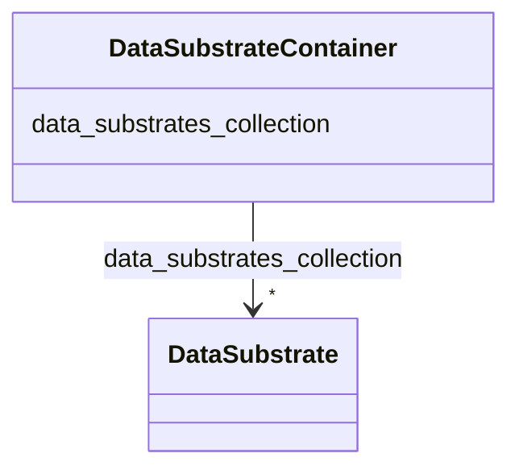

# Class: DataSubstrateContainer


_A container for DataSubstrates._


URI: [https://w3id.org/bridge2ai/standards-schema-all/:DataSubstrateContainer](https://w3id.org/bridge2ai/standards-schema-all/:DataSubstrateContainer)





<!-- no inheritance hierarchy -->


## Slots

| Name | Cardinality and Range | Description | Inheritance |
| ---  | --- | --- | --- |
| [data_substrates_collection](data_substrates_collection.md) | * <br/> [DataSubstrate](DataSubstrate.md) | Collection of associated data substrates | direct |


## Identifier and Mapping Information


### Schema Source


* from schema: https://w3id.org/bridge2ai/standards-schema-all


## Mappings

| Mapping Type | Mapped Value |
| ---  | ---  |
| self | https://w3id.org/bridge2ai/standards-schema-all/:DataSubstrateContainer |
| native | https://w3id.org/bridge2ai/standards-schema-all/:DataSubstrateContainer |


## LinkML Source

<!-- TODO: investigate https://stackoverflow.com/questions/37606292/how-to-create-tabbed-code-blocks-in-mkdocs-or-sphinx -->

### Direct

<details>
```yaml
name: DataSubstrateContainer
description: A container for DataSubstrates.
from_schema: https://w3id.org/bridge2ai/standards-schema-all
slots:
- data_substrates_collection

```
</details>

### Induced

<details>
```yaml
name: DataSubstrateContainer
description: A container for DataSubstrates.
from_schema: https://w3id.org/bridge2ai/standards-schema-all
attributes:
  data_substrates_collection:
    name: data_substrates_collection
    description: Collection of associated data substrates
    from_schema: https://w3id.org/bridge2ai/standards-schema-all
    rank: 1000
    alias: data_substrates_collection
    owner: DataSubstrateContainer
    domain_of:
    - DataSubstrateContainer
    range: DataSubstrate
    multivalued: true
    inlined: true
    inlined_as_list: true

```
</details>