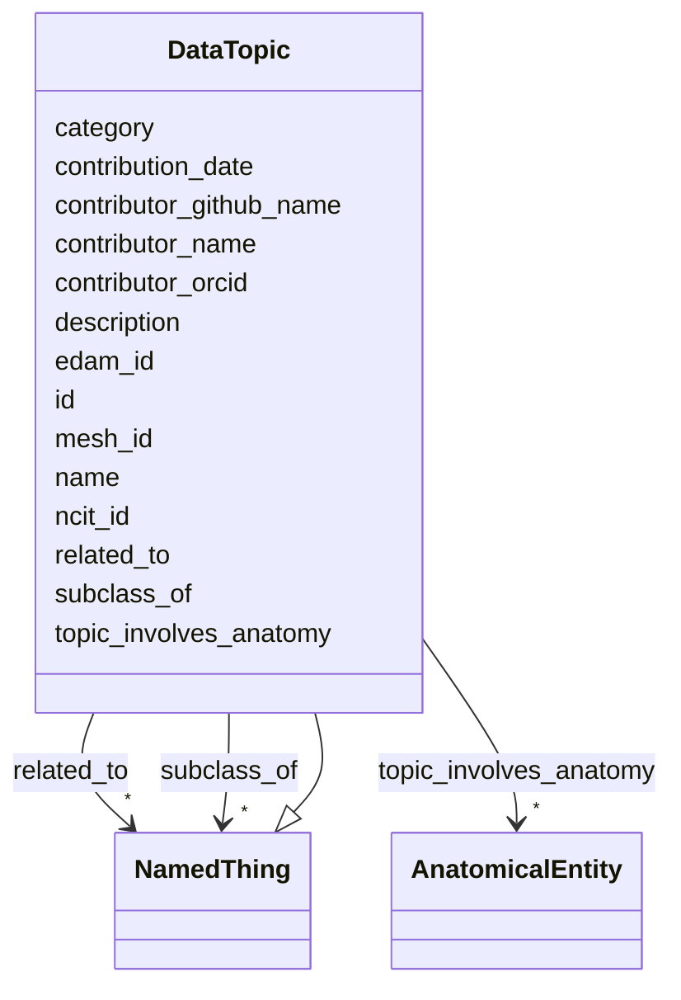

# Class: DataTopic


_Represents a general data topic for Bridge2AI data or the tools/standards applied to the data._


URI: [https://w3id.org/bridge2ai/standards-schema-all/:DataTopic](https://w3id.org/bridge2ai/standards-schema-all/:DataTopic)





## Inheritance
* [NamedThing](NamedThing.md)
    * **DataTopic**


## Slots

| Name | Cardinality and Range | Description | Inheritance |
| ---  | --- | --- | --- |
| [edam_id](edam_id.md) | 0..1 <br/> [EdamIdentifier](EdamIdentifier.md) | Unique EDAM identifier | direct |
| [mesh_id](mesh_id.md) | 0..1 <br/> [MeshIdentifier](MeshIdentifier.md) | Unique MeSH identifier | direct |
| [ncit_id](ncit_id.md) | 0..1 <br/> [NcitIdentifier](NcitIdentifier.md) | Unique NCIt Identifier | direct |
| [topic_involves_anatomy](topic_involves_anatomy.md) | * <br/> [AnatomicalEntity](AnatomicalEntity.md) | A relationship between a DataTopic and an anatomical entity | direct |
| [id](id.md) | 1 <br/> [Uriorcurie](Uriorcurie.md) | A unique identifier for a thing | [NamedThing](NamedThing.md) |
| [category](category.md) | 0..1 <br/> [CategoryType](CategoryType.md) | Name of the high level ontology class in which this entity is categorized | [NamedThing](NamedThing.md) |
| [name](name.md) | 0..1 <br/> [String](String.md) | A human-readable name for a thing | [NamedThing](NamedThing.md) |
| [description](description.md) | 0..1 <br/> [String](String.md) | A human-readable description for a thing | [NamedThing](NamedThing.md) |
| [subclass_of](subclass_of.md) | * <br/> [NamedThing](NamedThing.md) | Holds between two classes where the domain class is a specialization of the r... | [NamedThing](NamedThing.md) |
| [related_to](related_to.md) | * <br/> [NamedThing](NamedThing.md) | A relationship that is asserted between two named things | [NamedThing](NamedThing.md) |
| [contributor_name](contributor_name.md) | 0..1 <br/> [String](String.md) | The name of the person who added this node | [NamedThing](NamedThing.md) |
| [contributor_github_name](contributor_github_name.md) | 0..1 <br/> [String](String.md) | The name of the github user who added this node | [NamedThing](NamedThing.md) |
| [contributor_orcid](contributor_orcid.md) | 0..1 <br/> [Uriorcurie](Uriorcurie.md) | The ORCiD of the person who added this node | [NamedThing](NamedThing.md) |
| [contribution_date](contribution_date.md) | 0..1 <br/> [Date](Date.md) | The date on which the node was added | [NamedThing](NamedThing.md) |


## Usages

| used by | used in | type | used |
| ---  | --- | --- | --- |
| [DataStandardOrTool](DataStandardOrTool.md) | [concerns_data_topic](concerns_data_topic.md) | range | [DataTopic](DataTopic.md) |
| [DataStandard](DataStandard.md) | [concerns_data_topic](concerns_data_topic.md) | range | [DataTopic](DataTopic.md) |
| [BiomedicalStandard](BiomedicalStandard.md) | [concerns_data_topic](concerns_data_topic.md) | range | [DataTopic](DataTopic.md) |
| [Registry](Registry.md) | [concerns_data_topic](concerns_data_topic.md) | range | [DataTopic](DataTopic.md) |
| [OntologyOrVocabulary](OntologyOrVocabulary.md) | [concerns_data_topic](concerns_data_topic.md) | range | [DataTopic](DataTopic.md) |
| [ModelRepository](ModelRepository.md) | [concerns_data_topic](concerns_data_topic.md) | range | [DataTopic](DataTopic.md) |
| [ReferenceDataOrDataset](ReferenceDataOrDataset.md) | [concerns_data_topic](concerns_data_topic.md) | range | [DataTopic](DataTopic.md) |
| [SoftwareOrTool](SoftwareOrTool.md) | [concerns_data_topic](concerns_data_topic.md) | range | [DataTopic](DataTopic.md) |
| [ReferenceImplementation](ReferenceImplementation.md) | [concerns_data_topic](concerns_data_topic.md) | range | [DataTopic](DataTopic.md) |
| [TrainingProgram](TrainingProgram.md) | [concerns_data_topic](concerns_data_topic.md) | range | [DataTopic](DataTopic.md) |
| [DataTopic](DataTopic.md) | [topic_involves_anatomy](topic_involves_anatomy.md) | domain | [DataTopic](DataTopic.md) |
| [DataTopicContainer](DataTopicContainer.md) | [data_topics_collection](data_topics_collection.md) | range | [DataTopic](DataTopic.md) |
| [UseCase](UseCase.md) | [data_topics](data_topics.md) | range | [DataTopic](DataTopic.md) |


## Identifier and Mapping Information


### Schema Source


* from schema: https://w3id.org/bridge2ai/standards-schema-all


## Mappings

| Mapping Type | Mapped Value |
| ---  | ---  |
| self | https://w3id.org/bridge2ai/standards-schema-all/:DataTopic |
| native | https://w3id.org/bridge2ai/standards-schema-all/:DataTopic |


## LinkML Source

<!-- TODO: investigate https://stackoverflow.com/questions/37606292/how-to-create-tabbed-code-blocks-in-mkdocs-or-sphinx -->

### Direct

<details>
```yaml
name: DataTopic
description: Represents a general data topic for Bridge2AI data or the tools/standards
  applied to the data.
from_schema: https://w3id.org/bridge2ai/standards-schema-all
is_a: NamedThing
slots:
- edam_id
- mesh_id
- ncit_id
- topic_involves_anatomy

```
</details>

### Induced

<details>
```yaml
name: DataTopic
description: Represents a general data topic for Bridge2AI data or the tools/standards
  applied to the data.
from_schema: https://w3id.org/bridge2ai/standards-schema-all
is_a: NamedThing
attributes:
  edam_id:
    name: edam_id
    description: Unique EDAM identifier
    examples:
    - value: edam.data:0006
    from_schema: https://w3id.org/bridge2ai/standards-schema-all
    rank: 1000
    values_from:
    - edam.data
    - edam.format
    - edam.operation
    - edam.topic
    alias: edam_id
    owner: DataTopic
    domain_of:
    - DataSubstrate
    - DataTopic
    range: edam_identifier
  mesh_id:
    name: mesh_id
    description: Unique MeSH identifier
    examples:
    - value: mesh:D014831
    from_schema: https://w3id.org/bridge2ai/standards-schema-all
    rank: 1000
    values_from:
    - mesh
    alias: mesh_id
    owner: DataTopic
    domain_of:
    - DataSubstrate
    - DataTopic
    range: mesh_identifier
  ncit_id:
    name: ncit_id
    description: Unique NCIt Identifier
    examples:
    - value: ncit:C92692
    from_schema: https://w3id.org/bridge2ai/standards-schema-all
    rank: 1000
    values_from:
    - ncit
    alias: ncit_id
    owner: DataTopic
    domain_of:
    - DataSubstrate
    - DataTopic
    range: ncit_identifier
  topic_involves_anatomy:
    name: topic_involves_anatomy
    description: A relationship between a DataTopic and an anatomical entity.
    from_schema: https://w3id.org/bridge2ai/standards-schema-all
    exact_mappings:
    - RO:0004026
    rank: 1000
    is_a: related_to
    domain: DataTopic
    inherited: true
    alias: topic_involves_anatomy
    owner: DataTopic
    domain_of:
    - DataTopic
    range: AnatomicalEntity
    multivalued: true
  id:
    name: id
    description: A unique identifier for a thing.
    from_schema: https://w3id.org/bridge2ai/standards-schema-all
    rank: 1000
    slot_uri: schema:identifier
    identifier: true
    alias: id
    owner: DataTopic
    domain_of:
    - NamedThing
    range: uriorcurie
    required: true
  category:
    name: category
    description: Name of the high level ontology class in which this entity is categorized.
      Corresponds to the label for the entity type class, e.g., "BiomedicalStandard".
    from_schema: https://w3id.org/bridge2ai/standards-schema-all
    rank: 1000
    is_a: type
    domain: NamedThing
    designates_type: true
    alias: category
    owner: DataTopic
    domain_of:
    - NamedThing
    range: category_type
  name:
    name: name
    description: A human-readable name for a thing.
    from_schema: https://w3id.org/bridge2ai/standards-schema-all
    rank: 1000
    slot_uri: schema:name
    alias: name
    owner: DataTopic
    domain_of:
    - NamedThing
    range: string
  description:
    name: description
    description: A human-readable description for a thing.
    from_schema: https://w3id.org/bridge2ai/standards-schema-all
    rank: 1000
    slot_uri: schema:description
    alias: description
    owner: DataTopic
    domain_of:
    - NamedThing
    range: string
  subclass_of:
    name: subclass_of
    description: Holds between two classes where the domain class is a specialization
      of the range class.
    from_schema: https://w3id.org/bridge2ai/standards-schema-all
    exact_mappings:
    - rdfs:subClassOf
    - MESH:isa
    narrow_mappings:
    - rdfs:subPropertyOf
    rank: 1000
    is_a: related_to
    domain: NamedThing
    inherited: true
    alias: subclass_of
    owner: DataTopic
    domain_of:
    - NamedThing
    range: NamedThing
    multivalued: true
  related_to:
    name: related_to
    description: A relationship that is asserted between two named things.
    from_schema: https://w3id.org/bridge2ai/standards-schema-all
    rank: 1000
    domain: NamedThing
    inherited: true
    alias: related_to
    owner: DataTopic
    domain_of:
    - NamedThing
    - Organization
    symmetric: true
    range: NamedThing
    multivalued: true
  contributor_name:
    name: contributor_name
    description: The name of the person who added this node.
    from_schema: https://w3id.org/bridge2ai/standards-schema-all
    rank: 1000
    is_a: node_property
    domain: NamedThing
    alias: contributor_name
    owner: DataTopic
    domain_of:
    - NamedThing
    range: string
  contributor_github_name:
    name: contributor_github_name
    description: The name of the github user who added this node.
    from_schema: https://w3id.org/bridge2ai/standards-schema-all
    rank: 1000
    is_a: node_property
    domain: NamedThing
    alias: contributor_github_name
    owner: DataTopic
    domain_of:
    - NamedThing
    range: string
  contributor_orcid:
    name: contributor_orcid
    description: The ORCiD of the person who added this node.
    examples:
    - value: ORCID:0000-0001-1234-5678
    from_schema: https://w3id.org/bridge2ai/standards-schema-all
    rank: 1000
    is_a: node_property
    domain: NamedThing
    alias: contributor_orcid
    owner: DataTopic
    domain_of:
    - NamedThing
    range: uriorcurie
  contribution_date:
    name: contribution_date
    description: The date on which the node was added.
    examples:
    - value: '2023-03-20'
    from_schema: https://w3id.org/bridge2ai/standards-schema-all
    rank: 1000
    is_a: node_property
    domain: NamedThing
    alias: contribution_date
    owner: DataTopic
    domain_of:
    - NamedThing
    range: date

```
</details>