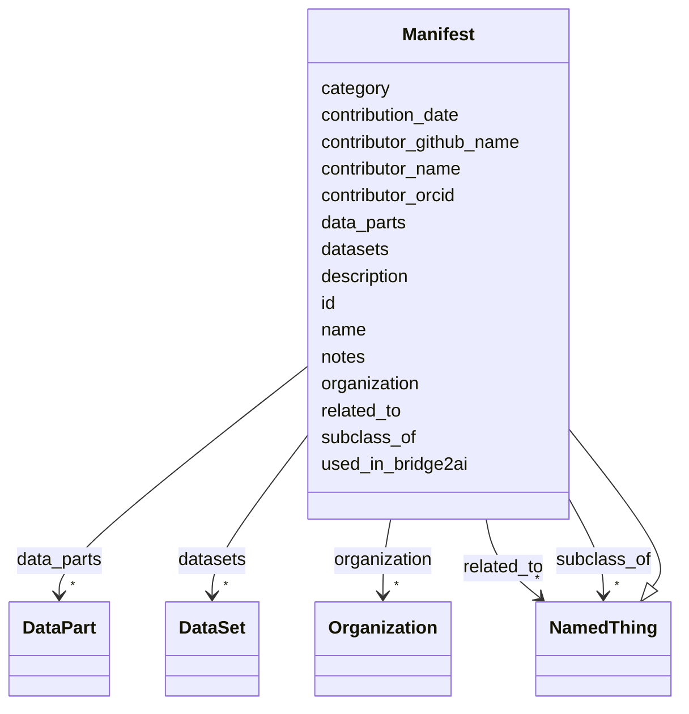

# Class: Manifest 


_Represents a manifest. There should be a 1 to 1 mapping between a manifest and an organization, but each manifest has its own ID._


URI: [https://w3id.org/bridge2ai/standards-schema-all/Manifest](https://w3id.org/bridge2ai/standards-schema-all/Manifest)





## Inheritance
* [NamedThing](NamedThing.md)
    * **Manifest**


## Slots

| Name | Cardinality and Range | Description | Inheritance |
| ---  | --- | --- | --- |
| [organization](organization.md) | * <br/> [Organization](Organization.md) | The manifest corresponds to this organization | direct |
| [datasets](datasets.md) | * <br/> [DataSet](DataSet.md) | The manifest includes these datasets | direct |
| [data_parts](data_parts.md) | * <br/> [DataPart](DataPart.md) | Collection of associated DataPart objects | direct |
| [notes](notes.md) | 0..1 <br/> [String](String.md) | Any additional notes about the manifest or the data part | direct |
| [id](id.md) | 1 <br/> [Uriorcurie](Uriorcurie.md) | A unique identifier for a thing | [NamedThing](NamedThing.md) |
| [category](category.md) | 0..1 <br/> [CategoryType](CategoryType.md) | CURIE for the high level ontology class in which this entity is categorized | [NamedThing](NamedThing.md) |
| [name](name.md) | 0..1 <br/> [String](String.md) | A human-readable name for a thing | [NamedThing](NamedThing.md) |
| [description](description.md) | 0..1 <br/> [String](String.md) | A human-readable description for a thing | [NamedThing](NamedThing.md) |
| [subclass_of](subclass_of.md) | * <br/> [NamedThing](NamedThing.md) | Holds between two classes where the domain class is a specialization of the r... | [NamedThing](NamedThing.md) |
| [related_to](related_to.md) | * <br/> [NamedThing](NamedThing.md) | A relationship that is asserted between two named things | [NamedThing](NamedThing.md) |
| [contributor_name](contributor_name.md) | 0..1 <br/> [String](String.md) | The name of the person who added this node | [NamedThing](NamedThing.md) |
| [contributor_github_name](contributor_github_name.md) | 0..1 <br/> [String](String.md) | The name of the github user who added this node | [NamedThing](NamedThing.md) |
| [contributor_orcid](contributor_orcid.md) | 0..1 <br/> [Uriorcurie](Uriorcurie.md) | The ORCiD of the person who added this node | [NamedThing](NamedThing.md) |
| [contribution_date](contribution_date.md) | 0..1 <br/> [Date](Date.md) | The date on which the node was added | [NamedThing](NamedThing.md) |
| [used_in_bridge2ai](used_in_bridge2ai.md) | 0..1 <br/> [Boolean](Boolean.md) | True if the entity is used, developed, or otherwise related to work in the Br... | [NamedThing](NamedThing.md) |


## Usages

| used by | used in | type | used |
| ---  | --- | --- | --- |
| [Manifest](Manifest.md) | [organization](organization.md) | domain | [Manifest](Manifest.md) |
| [Manifest](Manifest.md) | [datasets](datasets.md) | domain | [Manifest](Manifest.md) |
| [ManifestContainer](ManifestContainer.md) | [manifest_collection](manifest_collection.md) | range | [Manifest](Manifest.md) |


## Identifier and Mapping Information


### Schema Source


* from schema: https://w3id.org/bridge2ai/standards-schema-all


## Mappings

| Mapping Type | Mapped Value |
| ---  | ---  |
| self | https://w3id.org/bridge2ai/standards-schema-all/Manifest |
| native | https://w3id.org/bridge2ai/standards-schema-all/Manifest |


## LinkML Source

<!-- TODO: investigate https://stackoverflow.com/questions/37606292/how-to-create-tabbed-code-blocks-in-mkdocs-or-sphinx -->

### Direct

<details>
```yaml
name: Manifest
description: Represents a manifest. There should be a 1 to 1 mapping between a manifest
  and an organization, but each manifest has its own ID.
from_schema: https://w3id.org/bridge2ai/standards-schema-all
is_a: NamedThing
slots:
- organization
- datasets
- data_parts
- notes

```
</details>

### Induced

<details>
```yaml
name: Manifest
description: Represents a manifest. There should be a 1 to 1 mapping between a manifest
  and an organization, but each manifest has its own ID.
from_schema: https://w3id.org/bridge2ai/standards-schema-all
is_a: NamedThing
attributes:
  organization:
    name: organization
    description: The manifest corresponds to this organization. Must be a single Organization
      object, referenced with its B2AI_ORG ID.
    from_schema: https://w3id.org/bridge2ai/standards-schema-all
    rank: 1000
    is_a: related_to
    domain: Manifest
    inherited: true
    alias: organization
    owner: Manifest
    domain_of:
    - Manifest
    range: Organization
    multivalued: true
  datasets:
    name: datasets
    description: The manifest includes these datasets. Must be a list of Dataset objects,
      referenced with their B2AI_DATA IDs.
    from_schema: https://w3id.org/bridge2ai/standards-schema-all
    rank: 1000
    is_a: related_to
    domain: Manifest
    inherited: true
    alias: datasets
    owner: Manifest
    domain_of:
    - Manifest
    range: DataSet
    multivalued: true
  data_parts:
    name: data_parts
    description: Collection of associated DataPart objects.
    from_schema: https://w3id.org/bridge2ai/standards-schema-all
    rank: 1000
    alias: data_parts
    owner: Manifest
    domain_of:
    - Manifest
    range: DataPart
    multivalued: true
    inlined: true
    inlined_as_list: true
  notes:
    name: notes
    description: Any additional notes about the manifest or the data part.
    from_schema: https://w3id.org/bridge2ai/standards-schema-all
    rank: 1000
    is_a: node_property
    domain: NamedThing
    alias: notes
    owner: Manifest
    domain_of:
    - Manifest
    - DataPart
    range: string
  id:
    name: id
    description: A unique identifier for a thing.
    from_schema: https://w3id.org/bridge2ai/standards-schema-all
    rank: 1000
    slot_uri: schema:identifier
    identifier: true
    alias: id
    owner: Manifest
    domain_of:
    - NamedThing
    range: uriorcurie
    required: true
  category:
    name: category
    description: CURIE for the high level ontology class in which this entity is categorized.
      Corresponds to the label for the entity type class, e.g., "B2AI_STANDARD:DataStandard".
    from_schema: https://w3id.org/bridge2ai/standards-schema-all
    rank: 1000
    is_a: type
    domain: NamedThing
    designates_type: true
    alias: category
    owner: Manifest
    domain_of:
    - NamedThing
    range: category_type
  name:
    name: name
    description: A human-readable name for a thing.
    from_schema: https://w3id.org/bridge2ai/standards-schema-all
    rank: 1000
    slot_uri: schema:name
    alias: name
    owner: Manifest
    domain_of:
    - NamedThing
    range: string
  description:
    name: description
    description: A human-readable description for a thing.
    from_schema: https://w3id.org/bridge2ai/standards-schema-all
    rank: 1000
    slot_uri: schema:description
    alias: description
    owner: Manifest
    domain_of:
    - NamedThing
    range: string
  subclass_of:
    name: subclass_of
    description: Holds between two classes where the domain class is a specialization
      of the range class.
    from_schema: https://w3id.org/bridge2ai/standards-schema-all
    exact_mappings:
    - rdfs:subClassOf
    - MESH:isa
    narrow_mappings:
    - rdfs:subPropertyOf
    rank: 1000
    is_a: related_to
    domain: NamedThing
    inherited: true
    alias: subclass_of
    owner: Manifest
    domain_of:
    - NamedThing
    range: NamedThing
    multivalued: true
  related_to:
    name: related_to
    description: A relationship that is asserted between two named things.
    from_schema: https://w3id.org/bridge2ai/standards-schema-all
    rank: 1000
    domain: NamedThing
    inherited: true
    alias: related_to
    owner: Manifest
    domain_of:
    - NamedThing
    - Organization
    symmetric: true
    range: NamedThing
    multivalued: true
  contributor_name:
    name: contributor_name
    description: The name of the person who added this node.
    from_schema: https://w3id.org/bridge2ai/standards-schema-all
    rank: 1000
    is_a: node_property
    domain: NamedThing
    alias: contributor_name
    owner: Manifest
    domain_of:
    - NamedThing
    range: string
  contributor_github_name:
    name: contributor_github_name
    description: The name of the github user who added this node.
    from_schema: https://w3id.org/bridge2ai/standards-schema-all
    rank: 1000
    is_a: node_property
    domain: NamedThing
    alias: contributor_github_name
    owner: Manifest
    domain_of:
    - NamedThing
    range: string
  contributor_orcid:
    name: contributor_orcid
    description: The ORCiD of the person who added this node.
    examples:
    - value: ORCID:0000-0001-1234-5678
    from_schema: https://w3id.org/bridge2ai/standards-schema-all
    rank: 1000
    is_a: node_property
    domain: NamedThing
    alias: contributor_orcid
    owner: Manifest
    domain_of:
    - NamedThing
    range: uriorcurie
  contribution_date:
    name: contribution_date
    description: The date on which the node was added.
    examples:
    - value: '2023-03-20'
    from_schema: https://w3id.org/bridge2ai/standards-schema-all
    rank: 1000
    is_a: node_property
    domain: NamedThing
    alias: contribution_date
    owner: Manifest
    domain_of:
    - NamedThing
    range: date
  used_in_bridge2ai:
    name: used_in_bridge2ai
    description: True if the entity is used, developed, or otherwise related to work
      in the Bridge2AI consortium. If false, the entity is not explicitly related
      to Bridge2AI. If not specified, it is not known if the entity is related to
      Bridge2AI.
    from_schema: https://w3id.org/bridge2ai/standards-schema-all
    rank: 1000
    is_a: node_property
    domain: NamedThing
    alias: used_in_bridge2ai
    owner: Manifest
    domain_of:
    - NamedThing
    range: boolean

```
</details>