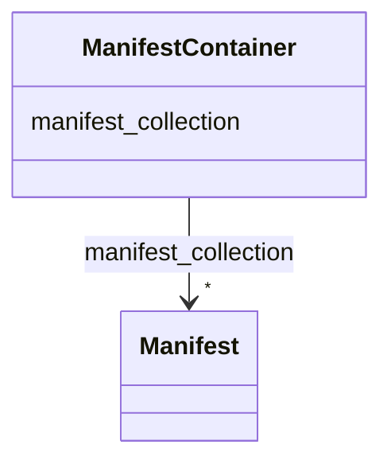

# Class: ManifestContainer 


_A container for Manifests._


URI: [https://w3id.org/bridge2ai/standards-schema-all/ManifestContainer](https://w3id.org/bridge2ai/standards-schema-all/ManifestContainer)





<!-- no inheritance hierarchy -->


## Slots

| Name | Cardinality and Range | Description | Inheritance |
| ---  | --- | --- | --- |
| [manifest_collection](manifest_collection.md) | * <br/> [Manifest](Manifest.md) | Collection of associated Manifest objects | direct |


## Identifier and Mapping Information


### Schema Source


* from schema: https://w3id.org/bridge2ai/standards-schema-all


## Mappings

| Mapping Type | Mapped Value |
| ---  | ---  |
| self | https://w3id.org/bridge2ai/standards-schema-all/ManifestContainer |
| native | https://w3id.org/bridge2ai/standards-schema-all/ManifestContainer |


## LinkML Source

<!-- TODO: investigate https://stackoverflow.com/questions/37606292/how-to-create-tabbed-code-blocks-in-mkdocs-or-sphinx -->

### Direct

<details>
```yaml
name: ManifestContainer
description: A container for Manifests.
from_schema: https://w3id.org/bridge2ai/standards-schema-all
slots:
- manifest_collection

```
</details>

### Induced

<details>
```yaml
name: ManifestContainer
description: A container for Manifests.
from_schema: https://w3id.org/bridge2ai/standards-schema-all
attributes:
  manifest_collection:
    name: manifest_collection
    description: Collection of associated Manifest objects.
    from_schema: https://w3id.org/bridge2ai/standards-schema-all
    rank: 1000
    alias: manifest_collection
    owner: ManifestContainer
    domain_of:
    - ManifestContainer
    range: Manifest
    multivalued: true
    inlined: true
    inlined_as_list: true

```
</details>