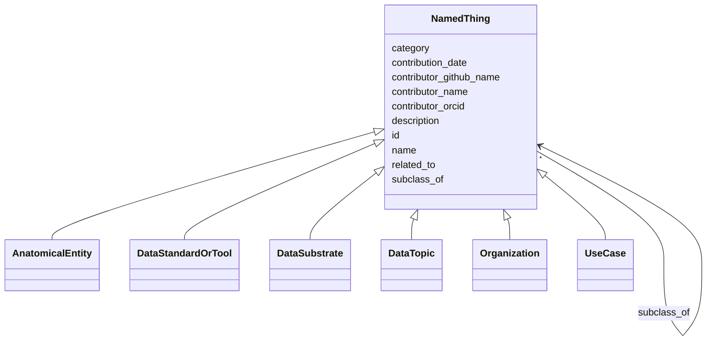

# Class: NamedThing


_A generic grouping for any identifiable entity_


URI: [schema:Thing](http://schema.org/Thing)





## Inheritance
* **NamedThing**
    * [AnatomicalEntity](AnatomicalEntity.md)
    * [DataStandardOrTool](DataStandardOrTool.md)
    * [DataSubstrate](DataSubstrate.md)
    * [DataTopic](DataTopic.md)
    * [Organization](Organization.md)
    * [UseCase](UseCase.md)


## Slots

| Name | Cardinality and Range | Description | Inheritance |
| ---  | --- | --- | --- |
| [id](id.md) | 1 <br/> [Uriorcurie](Uriorcurie.md) | A unique identifier for a thing | direct |
| [category](category.md) | 0..1 <br/> [CategoryType](CategoryType.md) | CURIE for the high level ontology class in which this entity is categorized | direct |
| [name](name.md) | 0..1 <br/> [String](String.md) | A human-readable name for a thing | direct |
| [description](description.md) | 0..1 <br/> [String](String.md) | A human-readable description for a thing | direct |
| [subclass_of](subclass_of.md) | * <br/> [NamedThing](NamedThing.md) | Holds between two classes where the domain class is a specialization of the r... | direct |
| [related_to](related_to.md) | * <br/> [NamedThing](NamedThing.md) | A relationship that is asserted between two named things | direct |
| [contributor_name](contributor_name.md) | 0..1 <br/> [String](String.md) | The name of the person who added this node | direct |
| [contributor_github_name](contributor_github_name.md) | 0..1 <br/> [String](String.md) | The name of the github user who added this node | direct |
| [contributor_orcid](contributor_orcid.md) | 0..1 <br/> [Uriorcurie](Uriorcurie.md) | The ORCiD of the person who added this node | direct |
| [contribution_date](contribution_date.md) | 0..1 <br/> [Date](Date.md) | The date on which the node was added | direct |


## Usages

| used by | used in | type | used |
| ---  | --- | --- | --- |
| [NamedThing](NamedThing.md) | [category](category.md) | domain | [NamedThing](NamedThing.md) |
| [NamedThing](NamedThing.md) | [subclass_of](subclass_of.md) | domain | [NamedThing](NamedThing.md) |
| [NamedThing](NamedThing.md) | [subclass_of](subclass_of.md) | range | [NamedThing](NamedThing.md) |
| [NamedThing](NamedThing.md) | [related_to](related_to.md) | domain | [NamedThing](NamedThing.md) |
| [NamedThing](NamedThing.md) | [related_to](related_to.md) | range | [NamedThing](NamedThing.md) |
| [NamedThing](NamedThing.md) | [contributor_name](contributor_name.md) | domain | [NamedThing](NamedThing.md) |
| [NamedThing](NamedThing.md) | [contributor_github_name](contributor_github_name.md) | domain | [NamedThing](NamedThing.md) |
| [NamedThing](NamedThing.md) | [contributor_orcid](contributor_orcid.md) | domain | [NamedThing](NamedThing.md) |
| [NamedThing](NamedThing.md) | [contribution_date](contribution_date.md) | domain | [NamedThing](NamedThing.md) |
| [AnatomicalEntity](AnatomicalEntity.md) | [category](category.md) | domain | [NamedThing](NamedThing.md) |
| [AnatomicalEntity](AnatomicalEntity.md) | [subclass_of](subclass_of.md) | domain | [NamedThing](NamedThing.md) |
| [AnatomicalEntity](AnatomicalEntity.md) | [subclass_of](subclass_of.md) | range | [NamedThing](NamedThing.md) |
| [AnatomicalEntity](AnatomicalEntity.md) | [related_to](related_to.md) | domain | [NamedThing](NamedThing.md) |
| [AnatomicalEntity](AnatomicalEntity.md) | [related_to](related_to.md) | range | [NamedThing](NamedThing.md) |
| [AnatomicalEntity](AnatomicalEntity.md) | [contributor_name](contributor_name.md) | domain | [NamedThing](NamedThing.md) |
| [AnatomicalEntity](AnatomicalEntity.md) | [contributor_github_name](contributor_github_name.md) | domain | [NamedThing](NamedThing.md) |
| [AnatomicalEntity](AnatomicalEntity.md) | [contributor_orcid](contributor_orcid.md) | domain | [NamedThing](NamedThing.md) |
| [AnatomicalEntity](AnatomicalEntity.md) | [contribution_date](contribution_date.md) | domain | [NamedThing](NamedThing.md) |
| [DataStandardOrTool](DataStandardOrTool.md) | [collection](collection.md) | domain | [NamedThing](NamedThing.md) |
| [DataStandardOrTool](DataStandardOrTool.md) | [has_training_resource](has_training_resource.md) | domain | [NamedThing](NamedThing.md) |
| [DataStandardOrTool](DataStandardOrTool.md) | [purpose_detail](purpose_detail.md) | domain | [NamedThing](NamedThing.md) |
| [DataStandardOrTool](DataStandardOrTool.md) | [is_open](is_open.md) | domain | [NamedThing](NamedThing.md) |
| [DataStandardOrTool](DataStandardOrTool.md) | [requires_registration](requires_registration.md) | domain | [NamedThing](NamedThing.md) |
| [DataStandardOrTool](DataStandardOrTool.md) | [url](url.md) | domain | [NamedThing](NamedThing.md) |
| [DataStandardOrTool](DataStandardOrTool.md) | [publication](publication.md) | domain | [NamedThing](NamedThing.md) |
| [DataStandardOrTool](DataStandardOrTool.md) | [formal_specification](formal_specification.md) | domain | [NamedThing](NamedThing.md) |
| [DataStandardOrTool](DataStandardOrTool.md) | [not_relevant_to_dgps](not_relevant_to_dgps.md) | domain | [NamedThing](NamedThing.md) |
| [DataStandardOrTool](DataStandardOrTool.md) | [category](category.md) | domain | [NamedThing](NamedThing.md) |
| [DataStandardOrTool](DataStandardOrTool.md) | [subclass_of](subclass_of.md) | domain | [NamedThing](NamedThing.md) |
| [DataStandardOrTool](DataStandardOrTool.md) | [subclass_of](subclass_of.md) | range | [NamedThing](NamedThing.md) |
| [DataStandardOrTool](DataStandardOrTool.md) | [related_to](related_to.md) | domain | [NamedThing](NamedThing.md) |
| [DataStandardOrTool](DataStandardOrTool.md) | [related_to](related_to.md) | range | [NamedThing](NamedThing.md) |
| [DataStandardOrTool](DataStandardOrTool.md) | [contributor_name](contributor_name.md) | domain | [NamedThing](NamedThing.md) |
| [DataStandardOrTool](DataStandardOrTool.md) | [contributor_github_name](contributor_github_name.md) | domain | [NamedThing](NamedThing.md) |
| [DataStandardOrTool](DataStandardOrTool.md) | [contributor_orcid](contributor_orcid.md) | domain | [NamedThing](NamedThing.md) |
| [DataStandardOrTool](DataStandardOrTool.md) | [contribution_date](contribution_date.md) | domain | [NamedThing](NamedThing.md) |
| [DataStandard](DataStandard.md) | [collection](collection.md) | domain | [NamedThing](NamedThing.md) |
| [DataStandard](DataStandard.md) | [has_training_resource](has_training_resource.md) | domain | [NamedThing](NamedThing.md) |
| [DataStandard](DataStandard.md) | [purpose_detail](purpose_detail.md) | domain | [NamedThing](NamedThing.md) |
| [DataStandard](DataStandard.md) | [is_open](is_open.md) | domain | [NamedThing](NamedThing.md) |
| [DataStandard](DataStandard.md) | [requires_registration](requires_registration.md) | domain | [NamedThing](NamedThing.md) |
| [DataStandard](DataStandard.md) | [url](url.md) | domain | [NamedThing](NamedThing.md) |
| [DataStandard](DataStandard.md) | [publication](publication.md) | domain | [NamedThing](NamedThing.md) |
| [DataStandard](DataStandard.md) | [formal_specification](formal_specification.md) | domain | [NamedThing](NamedThing.md) |
| [DataStandard](DataStandard.md) | [not_relevant_to_dgps](not_relevant_to_dgps.md) | domain | [NamedThing](NamedThing.md) |
| [DataStandard](DataStandard.md) | [category](category.md) | domain | [NamedThing](NamedThing.md) |
| [DataStandard](DataStandard.md) | [subclass_of](subclass_of.md) | domain | [NamedThing](NamedThing.md) |
| [DataStandard](DataStandard.md) | [subclass_of](subclass_of.md) | range | [NamedThing](NamedThing.md) |
| [DataStandard](DataStandard.md) | [related_to](related_to.md) | domain | [NamedThing](NamedThing.md) |
| [DataStandard](DataStandard.md) | [related_to](related_to.md) | range | [NamedThing](NamedThing.md) |
| [DataStandard](DataStandard.md) | [contributor_name](contributor_name.md) | domain | [NamedThing](NamedThing.md) |
| [DataStandard](DataStandard.md) | [contributor_github_name](contributor_github_name.md) | domain | [NamedThing](NamedThing.md) |
| [DataStandard](DataStandard.md) | [contributor_orcid](contributor_orcid.md) | domain | [NamedThing](NamedThing.md) |
| [DataStandard](DataStandard.md) | [contribution_date](contribution_date.md) | domain | [NamedThing](NamedThing.md) |
| [BiomedicalStandard](BiomedicalStandard.md) | [collection](collection.md) | domain | [NamedThing](NamedThing.md) |
| [BiomedicalStandard](BiomedicalStandard.md) | [has_training_resource](has_training_resource.md) | domain | [NamedThing](NamedThing.md) |
| [BiomedicalStandard](BiomedicalStandard.md) | [purpose_detail](purpose_detail.md) | domain | [NamedThing](NamedThing.md) |
| [BiomedicalStandard](BiomedicalStandard.md) | [is_open](is_open.md) | domain | [NamedThing](NamedThing.md) |
| [BiomedicalStandard](BiomedicalStandard.md) | [requires_registration](requires_registration.md) | domain | [NamedThing](NamedThing.md) |
| [BiomedicalStandard](BiomedicalStandard.md) | [url](url.md) | domain | [NamedThing](NamedThing.md) |
| [BiomedicalStandard](BiomedicalStandard.md) | [publication](publication.md) | domain | [NamedThing](NamedThing.md) |
| [BiomedicalStandard](BiomedicalStandard.md) | [formal_specification](formal_specification.md) | domain | [NamedThing](NamedThing.md) |
| [BiomedicalStandard](BiomedicalStandard.md) | [not_relevant_to_dgps](not_relevant_to_dgps.md) | domain | [NamedThing](NamedThing.md) |
| [BiomedicalStandard](BiomedicalStandard.md) | [category](category.md) | domain | [NamedThing](NamedThing.md) |
| [BiomedicalStandard](BiomedicalStandard.md) | [subclass_of](subclass_of.md) | domain | [NamedThing](NamedThing.md) |
| [BiomedicalStandard](BiomedicalStandard.md) | [subclass_of](subclass_of.md) | range | [NamedThing](NamedThing.md) |
| [BiomedicalStandard](BiomedicalStandard.md) | [related_to](related_to.md) | domain | [NamedThing](NamedThing.md) |
| [BiomedicalStandard](BiomedicalStandard.md) | [related_to](related_to.md) | range | [NamedThing](NamedThing.md) |
| [BiomedicalStandard](BiomedicalStandard.md) | [contributor_name](contributor_name.md) | domain | [NamedThing](NamedThing.md) |
| [BiomedicalStandard](BiomedicalStandard.md) | [contributor_github_name](contributor_github_name.md) | domain | [NamedThing](NamedThing.md) |
| [BiomedicalStandard](BiomedicalStandard.md) | [contributor_orcid](contributor_orcid.md) | domain | [NamedThing](NamedThing.md) |
| [BiomedicalStandard](BiomedicalStandard.md) | [contribution_date](contribution_date.md) | domain | [NamedThing](NamedThing.md) |
| [Registry](Registry.md) | [collection](collection.md) | domain | [NamedThing](NamedThing.md) |
| [Registry](Registry.md) | [has_training_resource](has_training_resource.md) | domain | [NamedThing](NamedThing.md) |
| [Registry](Registry.md) | [purpose_detail](purpose_detail.md) | domain | [NamedThing](NamedThing.md) |
| [Registry](Registry.md) | [is_open](is_open.md) | domain | [NamedThing](NamedThing.md) |
| [Registry](Registry.md) | [requires_registration](requires_registration.md) | domain | [NamedThing](NamedThing.md) |
| [Registry](Registry.md) | [url](url.md) | domain | [NamedThing](NamedThing.md) |
| [Registry](Registry.md) | [publication](publication.md) | domain | [NamedThing](NamedThing.md) |
| [Registry](Registry.md) | [formal_specification](formal_specification.md) | domain | [NamedThing](NamedThing.md) |
| [Registry](Registry.md) | [not_relevant_to_dgps](not_relevant_to_dgps.md) | domain | [NamedThing](NamedThing.md) |
| [Registry](Registry.md) | [category](category.md) | domain | [NamedThing](NamedThing.md) |
| [Registry](Registry.md) | [subclass_of](subclass_of.md) | domain | [NamedThing](NamedThing.md) |
| [Registry](Registry.md) | [subclass_of](subclass_of.md) | range | [NamedThing](NamedThing.md) |
| [Registry](Registry.md) | [related_to](related_to.md) | domain | [NamedThing](NamedThing.md) |
| [Registry](Registry.md) | [related_to](related_to.md) | range | [NamedThing](NamedThing.md) |
| [Registry](Registry.md) | [contributor_name](contributor_name.md) | domain | [NamedThing](NamedThing.md) |
| [Registry](Registry.md) | [contributor_github_name](contributor_github_name.md) | domain | [NamedThing](NamedThing.md) |
| [Registry](Registry.md) | [contributor_orcid](contributor_orcid.md) | domain | [NamedThing](NamedThing.md) |
| [Registry](Registry.md) | [contribution_date](contribution_date.md) | domain | [NamedThing](NamedThing.md) |
| [OntologyOrVocabulary](OntologyOrVocabulary.md) | [collection](collection.md) | domain | [NamedThing](NamedThing.md) |
| [OntologyOrVocabulary](OntologyOrVocabulary.md) | [has_training_resource](has_training_resource.md) | domain | [NamedThing](NamedThing.md) |
| [OntologyOrVocabulary](OntologyOrVocabulary.md) | [purpose_detail](purpose_detail.md) | domain | [NamedThing](NamedThing.md) |
| [OntologyOrVocabulary](OntologyOrVocabulary.md) | [is_open](is_open.md) | domain | [NamedThing](NamedThing.md) |
| [OntologyOrVocabulary](OntologyOrVocabulary.md) | [requires_registration](requires_registration.md) | domain | [NamedThing](NamedThing.md) |
| [OntologyOrVocabulary](OntologyOrVocabulary.md) | [url](url.md) | domain | [NamedThing](NamedThing.md) |
| [OntologyOrVocabulary](OntologyOrVocabulary.md) | [publication](publication.md) | domain | [NamedThing](NamedThing.md) |
| [OntologyOrVocabulary](OntologyOrVocabulary.md) | [formal_specification](formal_specification.md) | domain | [NamedThing](NamedThing.md) |
| [OntologyOrVocabulary](OntologyOrVocabulary.md) | [not_relevant_to_dgps](not_relevant_to_dgps.md) | domain | [NamedThing](NamedThing.md) |
| [OntologyOrVocabulary](OntologyOrVocabulary.md) | [category](category.md) | domain | [NamedThing](NamedThing.md) |
| [OntologyOrVocabulary](OntologyOrVocabulary.md) | [subclass_of](subclass_of.md) | domain | [NamedThing](NamedThing.md) |
| [OntologyOrVocabulary](OntologyOrVocabulary.md) | [subclass_of](subclass_of.md) | range | [NamedThing](NamedThing.md) |
| [OntologyOrVocabulary](OntologyOrVocabulary.md) | [related_to](related_to.md) | domain | [NamedThing](NamedThing.md) |
| [OntologyOrVocabulary](OntologyOrVocabulary.md) | [related_to](related_to.md) | range | [NamedThing](NamedThing.md) |
| [OntologyOrVocabulary](OntologyOrVocabulary.md) | [contributor_name](contributor_name.md) | domain | [NamedThing](NamedThing.md) |
| [OntologyOrVocabulary](OntologyOrVocabulary.md) | [contributor_github_name](contributor_github_name.md) | domain | [NamedThing](NamedThing.md) |
| [OntologyOrVocabulary](OntologyOrVocabulary.md) | [contributor_orcid](contributor_orcid.md) | domain | [NamedThing](NamedThing.md) |
| [OntologyOrVocabulary](OntologyOrVocabulary.md) | [contribution_date](contribution_date.md) | domain | [NamedThing](NamedThing.md) |
| [ModelRepository](ModelRepository.md) | [collection](collection.md) | domain | [NamedThing](NamedThing.md) |
| [ModelRepository](ModelRepository.md) | [has_training_resource](has_training_resource.md) | domain | [NamedThing](NamedThing.md) |
| [ModelRepository](ModelRepository.md) | [purpose_detail](purpose_detail.md) | domain | [NamedThing](NamedThing.md) |
| [ModelRepository](ModelRepository.md) | [is_open](is_open.md) | domain | [NamedThing](NamedThing.md) |
| [ModelRepository](ModelRepository.md) | [requires_registration](requires_registration.md) | domain | [NamedThing](NamedThing.md) |
| [ModelRepository](ModelRepository.md) | [url](url.md) | domain | [NamedThing](NamedThing.md) |
| [ModelRepository](ModelRepository.md) | [publication](publication.md) | domain | [NamedThing](NamedThing.md) |
| [ModelRepository](ModelRepository.md) | [formal_specification](formal_specification.md) | domain | [NamedThing](NamedThing.md) |
| [ModelRepository](ModelRepository.md) | [not_relevant_to_dgps](not_relevant_to_dgps.md) | domain | [NamedThing](NamedThing.md) |
| [ModelRepository](ModelRepository.md) | [category](category.md) | domain | [NamedThing](NamedThing.md) |
| [ModelRepository](ModelRepository.md) | [subclass_of](subclass_of.md) | domain | [NamedThing](NamedThing.md) |
| [ModelRepository](ModelRepository.md) | [subclass_of](subclass_of.md) | range | [NamedThing](NamedThing.md) |
| [ModelRepository](ModelRepository.md) | [related_to](related_to.md) | domain | [NamedThing](NamedThing.md) |
| [ModelRepository](ModelRepository.md) | [related_to](related_to.md) | range | [NamedThing](NamedThing.md) |
| [ModelRepository](ModelRepository.md) | [contributor_name](contributor_name.md) | domain | [NamedThing](NamedThing.md) |
| [ModelRepository](ModelRepository.md) | [contributor_github_name](contributor_github_name.md) | domain | [NamedThing](NamedThing.md) |
| [ModelRepository](ModelRepository.md) | [contributor_orcid](contributor_orcid.md) | domain | [NamedThing](NamedThing.md) |
| [ModelRepository](ModelRepository.md) | [contribution_date](contribution_date.md) | domain | [NamedThing](NamedThing.md) |
| [ReferenceDataOrDataset](ReferenceDataOrDataset.md) | [collection](collection.md) | domain | [NamedThing](NamedThing.md) |
| [ReferenceDataOrDataset](ReferenceDataOrDataset.md) | [has_training_resource](has_training_resource.md) | domain | [NamedThing](NamedThing.md) |
| [ReferenceDataOrDataset](ReferenceDataOrDataset.md) | [purpose_detail](purpose_detail.md) | domain | [NamedThing](NamedThing.md) |
| [ReferenceDataOrDataset](ReferenceDataOrDataset.md) | [is_open](is_open.md) | domain | [NamedThing](NamedThing.md) |
| [ReferenceDataOrDataset](ReferenceDataOrDataset.md) | [requires_registration](requires_registration.md) | domain | [NamedThing](NamedThing.md) |
| [ReferenceDataOrDataset](ReferenceDataOrDataset.md) | [url](url.md) | domain | [NamedThing](NamedThing.md) |
| [ReferenceDataOrDataset](ReferenceDataOrDataset.md) | [publication](publication.md) | domain | [NamedThing](NamedThing.md) |
| [ReferenceDataOrDataset](ReferenceDataOrDataset.md) | [formal_specification](formal_specification.md) | domain | [NamedThing](NamedThing.md) |
| [ReferenceDataOrDataset](ReferenceDataOrDataset.md) | [not_relevant_to_dgps](not_relevant_to_dgps.md) | domain | [NamedThing](NamedThing.md) |
| [ReferenceDataOrDataset](ReferenceDataOrDataset.md) | [category](category.md) | domain | [NamedThing](NamedThing.md) |
| [ReferenceDataOrDataset](ReferenceDataOrDataset.md) | [subclass_of](subclass_of.md) | domain | [NamedThing](NamedThing.md) |
| [ReferenceDataOrDataset](ReferenceDataOrDataset.md) | [subclass_of](subclass_of.md) | range | [NamedThing](NamedThing.md) |
| [ReferenceDataOrDataset](ReferenceDataOrDataset.md) | [related_to](related_to.md) | domain | [NamedThing](NamedThing.md) |
| [ReferenceDataOrDataset](ReferenceDataOrDataset.md) | [related_to](related_to.md) | range | [NamedThing](NamedThing.md) |
| [ReferenceDataOrDataset](ReferenceDataOrDataset.md) | [contributor_name](contributor_name.md) | domain | [NamedThing](NamedThing.md) |
| [ReferenceDataOrDataset](ReferenceDataOrDataset.md) | [contributor_github_name](contributor_github_name.md) | domain | [NamedThing](NamedThing.md) |
| [ReferenceDataOrDataset](ReferenceDataOrDataset.md) | [contributor_orcid](contributor_orcid.md) | domain | [NamedThing](NamedThing.md) |
| [ReferenceDataOrDataset](ReferenceDataOrDataset.md) | [contribution_date](contribution_date.md) | domain | [NamedThing](NamedThing.md) |
| [SoftwareOrTool](SoftwareOrTool.md) | [collection](collection.md) | domain | [NamedThing](NamedThing.md) |
| [SoftwareOrTool](SoftwareOrTool.md) | [has_training_resource](has_training_resource.md) | domain | [NamedThing](NamedThing.md) |
| [SoftwareOrTool](SoftwareOrTool.md) | [purpose_detail](purpose_detail.md) | domain | [NamedThing](NamedThing.md) |
| [SoftwareOrTool](SoftwareOrTool.md) | [is_open](is_open.md) | domain | [NamedThing](NamedThing.md) |
| [SoftwareOrTool](SoftwareOrTool.md) | [requires_registration](requires_registration.md) | domain | [NamedThing](NamedThing.md) |
| [SoftwareOrTool](SoftwareOrTool.md) | [url](url.md) | domain | [NamedThing](NamedThing.md) |
| [SoftwareOrTool](SoftwareOrTool.md) | [publication](publication.md) | domain | [NamedThing](NamedThing.md) |
| [SoftwareOrTool](SoftwareOrTool.md) | [formal_specification](formal_specification.md) | domain | [NamedThing](NamedThing.md) |
| [SoftwareOrTool](SoftwareOrTool.md) | [not_relevant_to_dgps](not_relevant_to_dgps.md) | domain | [NamedThing](NamedThing.md) |
| [SoftwareOrTool](SoftwareOrTool.md) | [category](category.md) | domain | [NamedThing](NamedThing.md) |
| [SoftwareOrTool](SoftwareOrTool.md) | [subclass_of](subclass_of.md) | domain | [NamedThing](NamedThing.md) |
| [SoftwareOrTool](SoftwareOrTool.md) | [subclass_of](subclass_of.md) | range | [NamedThing](NamedThing.md) |
| [SoftwareOrTool](SoftwareOrTool.md) | [related_to](related_to.md) | domain | [NamedThing](NamedThing.md) |
| [SoftwareOrTool](SoftwareOrTool.md) | [related_to](related_to.md) | range | [NamedThing](NamedThing.md) |
| [SoftwareOrTool](SoftwareOrTool.md) | [contributor_name](contributor_name.md) | domain | [NamedThing](NamedThing.md) |
| [SoftwareOrTool](SoftwareOrTool.md) | [contributor_github_name](contributor_github_name.md) | domain | [NamedThing](NamedThing.md) |
| [SoftwareOrTool](SoftwareOrTool.md) | [contributor_orcid](contributor_orcid.md) | domain | [NamedThing](NamedThing.md) |
| [SoftwareOrTool](SoftwareOrTool.md) | [contribution_date](contribution_date.md) | domain | [NamedThing](NamedThing.md) |
| [ReferenceImplementation](ReferenceImplementation.md) | [collection](collection.md) | domain | [NamedThing](NamedThing.md) |
| [ReferenceImplementation](ReferenceImplementation.md) | [has_training_resource](has_training_resource.md) | domain | [NamedThing](NamedThing.md) |
| [ReferenceImplementation](ReferenceImplementation.md) | [purpose_detail](purpose_detail.md) | domain | [NamedThing](NamedThing.md) |
| [ReferenceImplementation](ReferenceImplementation.md) | [is_open](is_open.md) | domain | [NamedThing](NamedThing.md) |
| [ReferenceImplementation](ReferenceImplementation.md) | [requires_registration](requires_registration.md) | domain | [NamedThing](NamedThing.md) |
| [ReferenceImplementation](ReferenceImplementation.md) | [url](url.md) | domain | [NamedThing](NamedThing.md) |
| [ReferenceImplementation](ReferenceImplementation.md) | [publication](publication.md) | domain | [NamedThing](NamedThing.md) |
| [ReferenceImplementation](ReferenceImplementation.md) | [formal_specification](formal_specification.md) | domain | [NamedThing](NamedThing.md) |
| [ReferenceImplementation](ReferenceImplementation.md) | [not_relevant_to_dgps](not_relevant_to_dgps.md) | domain | [NamedThing](NamedThing.md) |
| [ReferenceImplementation](ReferenceImplementation.md) | [category](category.md) | domain | [NamedThing](NamedThing.md) |
| [ReferenceImplementation](ReferenceImplementation.md) | [subclass_of](subclass_of.md) | domain | [NamedThing](NamedThing.md) |
| [ReferenceImplementation](ReferenceImplementation.md) | [subclass_of](subclass_of.md) | range | [NamedThing](NamedThing.md) |
| [ReferenceImplementation](ReferenceImplementation.md) | [related_to](related_to.md) | domain | [NamedThing](NamedThing.md) |
| [ReferenceImplementation](ReferenceImplementation.md) | [related_to](related_to.md) | range | [NamedThing](NamedThing.md) |
| [ReferenceImplementation](ReferenceImplementation.md) | [contributor_name](contributor_name.md) | domain | [NamedThing](NamedThing.md) |
| [ReferenceImplementation](ReferenceImplementation.md) | [contributor_github_name](contributor_github_name.md) | domain | [NamedThing](NamedThing.md) |
| [ReferenceImplementation](ReferenceImplementation.md) | [contributor_orcid](contributor_orcid.md) | domain | [NamedThing](NamedThing.md) |
| [ReferenceImplementation](ReferenceImplementation.md) | [contribution_date](contribution_date.md) | domain | [NamedThing](NamedThing.md) |
| [TrainingProgram](TrainingProgram.md) | [collection](collection.md) | domain | [NamedThing](NamedThing.md) |
| [TrainingProgram](TrainingProgram.md) | [has_training_resource](has_training_resource.md) | domain | [NamedThing](NamedThing.md) |
| [TrainingProgram](TrainingProgram.md) | [purpose_detail](purpose_detail.md) | domain | [NamedThing](NamedThing.md) |
| [TrainingProgram](TrainingProgram.md) | [is_open](is_open.md) | domain | [NamedThing](NamedThing.md) |
| [TrainingProgram](TrainingProgram.md) | [requires_registration](requires_registration.md) | domain | [NamedThing](NamedThing.md) |
| [TrainingProgram](TrainingProgram.md) | [url](url.md) | domain | [NamedThing](NamedThing.md) |
| [TrainingProgram](TrainingProgram.md) | [publication](publication.md) | domain | [NamedThing](NamedThing.md) |
| [TrainingProgram](TrainingProgram.md) | [formal_specification](formal_specification.md) | domain | [NamedThing](NamedThing.md) |
| [TrainingProgram](TrainingProgram.md) | [not_relevant_to_dgps](not_relevant_to_dgps.md) | domain | [NamedThing](NamedThing.md) |
| [TrainingProgram](TrainingProgram.md) | [category](category.md) | domain | [NamedThing](NamedThing.md) |
| [TrainingProgram](TrainingProgram.md) | [subclass_of](subclass_of.md) | domain | [NamedThing](NamedThing.md) |
| [TrainingProgram](TrainingProgram.md) | [subclass_of](subclass_of.md) | range | [NamedThing](NamedThing.md) |
| [TrainingProgram](TrainingProgram.md) | [related_to](related_to.md) | domain | [NamedThing](NamedThing.md) |
| [TrainingProgram](TrainingProgram.md) | [related_to](related_to.md) | range | [NamedThing](NamedThing.md) |
| [TrainingProgram](TrainingProgram.md) | [contributor_name](contributor_name.md) | domain | [NamedThing](NamedThing.md) |
| [TrainingProgram](TrainingProgram.md) | [contributor_github_name](contributor_github_name.md) | domain | [NamedThing](NamedThing.md) |
| [TrainingProgram](TrainingProgram.md) | [contributor_orcid](contributor_orcid.md) | domain | [NamedThing](NamedThing.md) |
| [TrainingProgram](TrainingProgram.md) | [contribution_date](contribution_date.md) | domain | [NamedThing](NamedThing.md) |
| [DataSubstrate](DataSubstrate.md) | [metadata_storage](metadata_storage.md) | domain | [NamedThing](NamedThing.md) |
| [DataSubstrate](DataSubstrate.md) | [file_extensions](file_extensions.md) | domain | [NamedThing](NamedThing.md) |
| [DataSubstrate](DataSubstrate.md) | [limitations](limitations.md) | domain | [NamedThing](NamedThing.md) |
| [DataSubstrate](DataSubstrate.md) | [category](category.md) | domain | [NamedThing](NamedThing.md) |
| [DataSubstrate](DataSubstrate.md) | [subclass_of](subclass_of.md) | domain | [NamedThing](NamedThing.md) |
| [DataSubstrate](DataSubstrate.md) | [subclass_of](subclass_of.md) | range | [NamedThing](NamedThing.md) |
| [DataSubstrate](DataSubstrate.md) | [related_to](related_to.md) | domain | [NamedThing](NamedThing.md) |
| [DataSubstrate](DataSubstrate.md) | [related_to](related_to.md) | range | [NamedThing](NamedThing.md) |
| [DataSubstrate](DataSubstrate.md) | [contributor_name](contributor_name.md) | domain | [NamedThing](NamedThing.md) |
| [DataSubstrate](DataSubstrate.md) | [contributor_github_name](contributor_github_name.md) | domain | [NamedThing](NamedThing.md) |
| [DataSubstrate](DataSubstrate.md) | [contributor_orcid](contributor_orcid.md) | domain | [NamedThing](NamedThing.md) |
| [DataSubstrate](DataSubstrate.md) | [contribution_date](contribution_date.md) | domain | [NamedThing](NamedThing.md) |
| [DataTopic](DataTopic.md) | [category](category.md) | domain | [NamedThing](NamedThing.md) |
| [DataTopic](DataTopic.md) | [subclass_of](subclass_of.md) | domain | [NamedThing](NamedThing.md) |
| [DataTopic](DataTopic.md) | [subclass_of](subclass_of.md) | range | [NamedThing](NamedThing.md) |
| [DataTopic](DataTopic.md) | [related_to](related_to.md) | domain | [NamedThing](NamedThing.md) |
| [DataTopic](DataTopic.md) | [related_to](related_to.md) | range | [NamedThing](NamedThing.md) |
| [DataTopic](DataTopic.md) | [contributor_name](contributor_name.md) | domain | [NamedThing](NamedThing.md) |
| [DataTopic](DataTopic.md) | [contributor_github_name](contributor_github_name.md) | domain | [NamedThing](NamedThing.md) |
| [DataTopic](DataTopic.md) | [contributor_orcid](contributor_orcid.md) | domain | [NamedThing](NamedThing.md) |
| [DataTopic](DataTopic.md) | [contribution_date](contribution_date.md) | domain | [NamedThing](NamedThing.md) |
| [Organization](Organization.md) | [url](url.md) | domain | [NamedThing](NamedThing.md) |
| [Organization](Organization.md) | [related_to](related_to.md) | domain | [NamedThing](NamedThing.md) |
| [Organization](Organization.md) | [related_to](related_to.md) | range | [NamedThing](NamedThing.md) |
| [Organization](Organization.md) | [category](category.md) | domain | [NamedThing](NamedThing.md) |
| [Organization](Organization.md) | [subclass_of](subclass_of.md) | domain | [NamedThing](NamedThing.md) |
| [Organization](Organization.md) | [subclass_of](subclass_of.md) | range | [NamedThing](NamedThing.md) |
| [Organization](Organization.md) | [contributor_name](contributor_name.md) | domain | [NamedThing](NamedThing.md) |
| [Organization](Organization.md) | [contributor_github_name](contributor_github_name.md) | domain | [NamedThing](NamedThing.md) |
| [Organization](Organization.md) | [contributor_orcid](contributor_orcid.md) | domain | [NamedThing](NamedThing.md) |
| [Organization](Organization.md) | [contribution_date](contribution_date.md) | domain | [NamedThing](NamedThing.md) |
| [UseCase](UseCase.md) | [use_case_category](use_case_category.md) | domain | [NamedThing](NamedThing.md) |
| [UseCase](UseCase.md) | [known_limitations](known_limitations.md) | domain | [NamedThing](NamedThing.md) |
| [UseCase](UseCase.md) | [data_topics](data_topics.md) | domain | [NamedThing](NamedThing.md) |
| [UseCase](UseCase.md) | [data_substrates](data_substrates.md) | domain | [NamedThing](NamedThing.md) |
| [UseCase](UseCase.md) | [standards_and_tools_for_dgp_use](standards_and_tools_for_dgp_use.md) | domain | [NamedThing](NamedThing.md) |
| [UseCase](UseCase.md) | [alternative_standards_and_tools](alternative_standards_and_tools.md) | domain | [NamedThing](NamedThing.md) |
| [UseCase](UseCase.md) | [enables](enables.md) | domain | [NamedThing](NamedThing.md) |
| [UseCase](UseCase.md) | [involved_in_experimental_design](involved_in_experimental_design.md) | domain | [NamedThing](NamedThing.md) |
| [UseCase](UseCase.md) | [involved_in_metadata_management](involved_in_metadata_management.md) | domain | [NamedThing](NamedThing.md) |
| [UseCase](UseCase.md) | [involved_in_quality_control](involved_in_quality_control.md) | domain | [NamedThing](NamedThing.md) |
| [UseCase](UseCase.md) | [xref](xref.md) | domain | [NamedThing](NamedThing.md) |
| [UseCase](UseCase.md) | [category](category.md) | domain | [NamedThing](NamedThing.md) |
| [UseCase](UseCase.md) | [subclass_of](subclass_of.md) | domain | [NamedThing](NamedThing.md) |
| [UseCase](UseCase.md) | [subclass_of](subclass_of.md) | range | [NamedThing](NamedThing.md) |
| [UseCase](UseCase.md) | [related_to](related_to.md) | domain | [NamedThing](NamedThing.md) |
| [UseCase](UseCase.md) | [related_to](related_to.md) | range | [NamedThing](NamedThing.md) |
| [UseCase](UseCase.md) | [contributor_name](contributor_name.md) | domain | [NamedThing](NamedThing.md) |
| [UseCase](UseCase.md) | [contributor_github_name](contributor_github_name.md) | domain | [NamedThing](NamedThing.md) |
| [UseCase](UseCase.md) | [contributor_orcid](contributor_orcid.md) | domain | [NamedThing](NamedThing.md) |
| [UseCase](UseCase.md) | [contribution_date](contribution_date.md) | domain | [NamedThing](NamedThing.md) |


## Identifier and Mapping Information


### Schema Source


* from schema: https://w3id.org/bridge2ai/standards-schema-all


## Mappings

| Mapping Type | Mapped Value |
| ---  | ---  |
| self | schema:Thing |
| native | https://w3id.org/bridge2ai/standards-schema-all/:NamedThing |


## LinkML Source

<!-- TODO: investigate https://stackoverflow.com/questions/37606292/how-to-create-tabbed-code-blocks-in-mkdocs-or-sphinx -->

### Direct

<details>
```yaml
name: NamedThing
description: A generic grouping for any identifiable entity
from_schema: https://w3id.org/bridge2ai/standards-schema-all
slots:
- id
- category
- name
- description
- subclass_of
- related_to
- contributor_name
- contributor_github_name
- contributor_orcid
- contribution_date
class_uri: schema:Thing

```
</details>

### Induced

<details>
```yaml
name: NamedThing
description: A generic grouping for any identifiable entity
from_schema: https://w3id.org/bridge2ai/standards-schema-all
attributes:
  id:
    name: id
    description: A unique identifier for a thing.
    from_schema: https://w3id.org/bridge2ai/standards-schema-all
    rank: 1000
    slot_uri: schema:identifier
    identifier: true
    alias: id
    owner: NamedThing
    domain_of:
    - NamedThing
    range: uriorcurie
    required: true
  category:
    name: category
    description: CURIE for the high level ontology class in which this entity is categorized.
      Corresponds to the label for the entity type class, e.g., "B2AI_STANDARD:DataStandard".
    from_schema: https://w3id.org/bridge2ai/standards-schema-all
    rank: 1000
    is_a: type
    domain: NamedThing
    designates_type: true
    alias: category
    owner: NamedThing
    domain_of:
    - NamedThing
    range: category_type
  name:
    name: name
    description: A human-readable name for a thing.
    from_schema: https://w3id.org/bridge2ai/standards-schema-all
    rank: 1000
    slot_uri: schema:name
    alias: name
    owner: NamedThing
    domain_of:
    - NamedThing
    range: string
  description:
    name: description
    description: A human-readable description for a thing.
    from_schema: https://w3id.org/bridge2ai/standards-schema-all
    rank: 1000
    slot_uri: schema:description
    alias: description
    owner: NamedThing
    domain_of:
    - NamedThing
    range: string
  subclass_of:
    name: subclass_of
    description: Holds between two classes where the domain class is a specialization
      of the range class.
    from_schema: https://w3id.org/bridge2ai/standards-schema-all
    exact_mappings:
    - rdfs:subClassOf
    - MESH:isa
    narrow_mappings:
    - rdfs:subPropertyOf
    rank: 1000
    is_a: related_to
    domain: NamedThing
    inherited: true
    alias: subclass_of
    owner: NamedThing
    domain_of:
    - NamedThing
    range: NamedThing
    multivalued: true
  related_to:
    name: related_to
    description: A relationship that is asserted between two named things.
    from_schema: https://w3id.org/bridge2ai/standards-schema-all
    rank: 1000
    domain: NamedThing
    inherited: true
    alias: related_to
    owner: NamedThing
    domain_of:
    - NamedThing
    - Organization
    symmetric: true
    range: NamedThing
    multivalued: true
  contributor_name:
    name: contributor_name
    description: The name of the person who added this node.
    from_schema: https://w3id.org/bridge2ai/standards-schema-all
    rank: 1000
    is_a: node_property
    domain: NamedThing
    alias: contributor_name
    owner: NamedThing
    domain_of:
    - NamedThing
    range: string
  contributor_github_name:
    name: contributor_github_name
    description: The name of the github user who added this node.
    from_schema: https://w3id.org/bridge2ai/standards-schema-all
    rank: 1000
    is_a: node_property
    domain: NamedThing
    alias: contributor_github_name
    owner: NamedThing
    domain_of:
    - NamedThing
    range: string
  contributor_orcid:
    name: contributor_orcid
    description: The ORCiD of the person who added this node.
    examples:
    - value: ORCID:0000-0001-1234-5678
    from_schema: https://w3id.org/bridge2ai/standards-schema-all
    rank: 1000
    is_a: node_property
    domain: NamedThing
    alias: contributor_orcid
    owner: NamedThing
    domain_of:
    - NamedThing
    range: uriorcurie
  contribution_date:
    name: contribution_date
    description: The date on which the node was added.
    examples:
    - value: '2023-03-20'
    from_schema: https://w3id.org/bridge2ai/standards-schema-all
    rank: 1000
    is_a: node_property
    domain: NamedThing
    alias: contribution_date
    owner: NamedThing
    domain_of:
    - NamedThing
    range: date
class_uri: schema:Thing

```
</details>