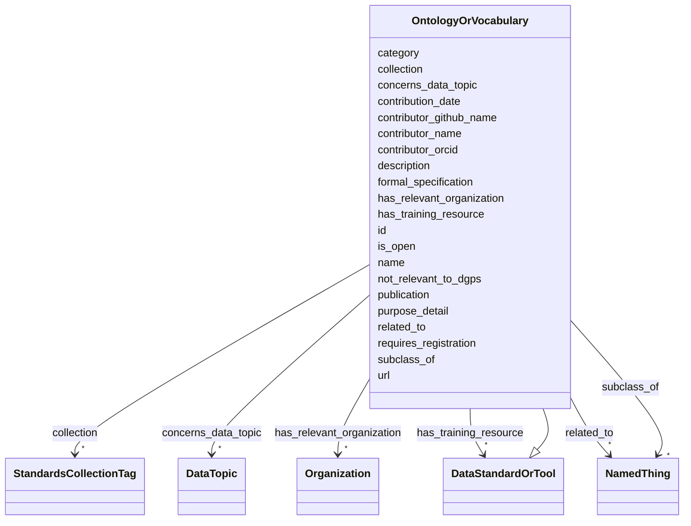

# Class: OntologyOrVocabulary


_A set of concepts and categories, potentially defined or accompanied by their hierarchical relationships._


URI: [https://w3id.org/bridge2ai/standards-schema-all/:OntologyOrVocabulary](https://w3id.org/bridge2ai/standards-schema-all/:OntologyOrVocabulary)





## Inheritance
* [NamedThing](NamedThing.md)
    * [DataStandardOrTool](DataStandardOrTool.md)
        * **OntologyOrVocabulary**


## Slots

| Name | Cardinality and Range | Description | Inheritance |
| ---  | --- | --- | --- |
| [collection](collection.md) | * <br/> [StandardsCollectionTag](StandardsCollectionTag.md) | Tags for specific sets of standards | [DataStandardOrTool](DataStandardOrTool.md) |
| [concerns_data_topic](concerns_data_topic.md) | * <br/> [DataTopic](DataTopic.md) | Subject standard is generally applied in the context of object data topic | [DataStandardOrTool](DataStandardOrTool.md) |
| [has_relevant_organization](has_relevant_organization.md) | * <br/> [Organization](Organization.md) | Subject standard is managed or otherwise guided buy the object organization(s... | [DataStandardOrTool](DataStandardOrTool.md) |
| [has_training_resource](has_training_resource.md) | * <br/> [DataStandardOrTool](DataStandardOrTool.md) | Relevant training resources, standard usage manuals, or other documentation f... | [DataStandardOrTool](DataStandardOrTool.md) |
| [purpose_detail](purpose_detail.md) | 0..1 <br/> [String](String.md) | Text description of the standard or tool | [DataStandardOrTool](DataStandardOrTool.md) |
| [is_open](is_open.md) | 0..1 <br/> [Boolean](Boolean.md) | Is the standard or tool FAIR and available free of cost? | [DataStandardOrTool](DataStandardOrTool.md) |
| [requires_registration](requires_registration.md) | 0..1 <br/> [Boolean](Boolean.md) | Does usage of the standard or tool require registration of a user or group wi... | [DataStandardOrTool](DataStandardOrTool.md) |
| [url](url.md) | 0..1 <br/> [Uriorcurie](Uriorcurie.md) | URL for basic documentation of the standard or tool | [DataStandardOrTool](DataStandardOrTool.md) |
| [publication](publication.md) | 0..1 <br/> [Uriorcurie](Uriorcurie.md) | Relevant publication for the standard or tool | [DataStandardOrTool](DataStandardOrTool.md) |
| [formal_specification](formal_specification.md) | 0..1 <br/> [Uriorcurie](Uriorcurie.md) | Relevant code repository or other location for a formal specification of the ... | [DataStandardOrTool](DataStandardOrTool.md) |
| [not_relevant_to_dgps](not_relevant_to_dgps.md) | 0..1 <br/> [Boolean](Boolean.md) | Is the standard or tool currently relevant to DGPs? | [DataStandardOrTool](DataStandardOrTool.md) |
| [id](id.md) | 1 <br/> [Uriorcurie](Uriorcurie.md) | A unique identifier for a thing | [NamedThing](NamedThing.md) |
| [category](category.md) | 0..1 <br/> [CategoryType](CategoryType.md) | CURIE for the high level ontology class in which this entity is categorized | [NamedThing](NamedThing.md) |
| [name](name.md) | 0..1 <br/> [String](String.md) | A human-readable name for a thing | [NamedThing](NamedThing.md) |
| [description](description.md) | 0..1 <br/> [String](String.md) | A human-readable description for a thing | [NamedThing](NamedThing.md) |
| [subclass_of](subclass_of.md) | * <br/> [NamedThing](NamedThing.md) | Holds between two classes where the domain class is a specialization of the r... | [NamedThing](NamedThing.md) |
| [related_to](related_to.md) | * <br/> [NamedThing](NamedThing.md) | A relationship that is asserted between two named things | [NamedThing](NamedThing.md) |
| [contributor_name](contributor_name.md) | 0..1 <br/> [String](String.md) | The name of the person who added this node | [NamedThing](NamedThing.md) |
| [contributor_github_name](contributor_github_name.md) | 0..1 <br/> [String](String.md) | The name of the github user who added this node | [NamedThing](NamedThing.md) |
| [contributor_orcid](contributor_orcid.md) | 0..1 <br/> [Uriorcurie](Uriorcurie.md) | The ORCiD of the person who added this node | [NamedThing](NamedThing.md) |
| [contribution_date](contribution_date.md) | 0..1 <br/> [Date](Date.md) | The date on which the node was added | [NamedThing](NamedThing.md) |


## Identifier and Mapping Information


### Schema Source


* from schema: https://w3id.org/bridge2ai/standards-schema-all


## Mappings

| Mapping Type | Mapped Value |
| ---  | ---  |
| self | https://w3id.org/bridge2ai/standards-schema-all/:OntologyOrVocabulary |
| native | https://w3id.org/bridge2ai/standards-schema-all/:OntologyOrVocabulary |


## LinkML Source

<!-- TODO: investigate https://stackoverflow.com/questions/37606292/how-to-create-tabbed-code-blocks-in-mkdocs-or-sphinx -->

### Direct

<details>
```yaml
name: OntologyOrVocabulary
description: A set of concepts and categories, potentially defined or accompanied
  by their hierarchical relationships.
from_schema: https://w3id.org/bridge2ai/standards-schema-all
is_a: DataStandardOrTool

```
</details>

### Induced

<details>
```yaml
name: OntologyOrVocabulary
description: A set of concepts and categories, potentially defined or accompanied
  by their hierarchical relationships.
from_schema: https://w3id.org/bridge2ai/standards-schema-all
is_a: DataStandardOrTool
attributes:
  collection:
    name: collection
    description: Tags for specific sets of standards.
    from_schema: https://w3id.org/bridge2ai/standards-schema-all
    rank: 1000
    is_a: node_property
    domain: NamedThing
    alias: collection
    owner: OntologyOrVocabulary
    domain_of:
    - DataStandardOrTool
    range: StandardsCollectionTag
    multivalued: true
  concerns_data_topic:
    name: concerns_data_topic
    description: Subject standard is generally applied in the context of object data
      topic.
    from_schema: https://w3id.org/bridge2ai/standards-schema-all
    rank: 1000
    is_a: related_to
    domain: DataStandardOrTool
    inherited: true
    alias: concerns_data_topic
    owner: OntologyOrVocabulary
    domain_of:
    - DataStandardOrTool
    range: DataTopic
    multivalued: true
  has_relevant_organization:
    name: has_relevant_organization
    description: Subject standard is managed or otherwise guided buy the object organization(s).
    from_schema: https://w3id.org/bridge2ai/standards-schema-all
    rank: 1000
    is_a: related_to
    domain: DataStandardOrTool
    inherited: true
    alias: has_relevant_organization
    owner: OntologyOrVocabulary
    domain_of:
    - DataStandardOrTool
    range: Organization
    multivalued: true
  has_training_resource:
    name: has_training_resource
    description: Relevant training resources, standard usage manuals, or other documentation
      for the standard or tool.
    from_schema: https://w3id.org/bridge2ai/standards-schema-all
    rank: 1000
    is_a: node_property
    domain: NamedThing
    alias: has_training_resource
    owner: OntologyOrVocabulary
    domain_of:
    - DataStandardOrTool
    range: DataStandardOrTool
    multivalued: true
  purpose_detail:
    name: purpose_detail
    description: Text description of the standard or tool.
    from_schema: https://w3id.org/bridge2ai/standards-schema-all
    rank: 1000
    is_a: node_property
    domain: NamedThing
    alias: purpose_detail
    owner: OntologyOrVocabulary
    domain_of:
    - DataStandardOrTool
    range: string
  is_open:
    name: is_open
    description: Is the standard or tool FAIR and available free of cost?
    from_schema: https://w3id.org/bridge2ai/standards-schema-all
    rank: 1000
    is_a: node_property
    domain: NamedThing
    alias: is_open
    owner: OntologyOrVocabulary
    domain_of:
    - DataStandardOrTool
    range: boolean
  requires_registration:
    name: requires_registration
    description: Does usage of the standard or tool require registration of a user
      or group with some organization or managerial body?
    from_schema: https://w3id.org/bridge2ai/standards-schema-all
    rank: 1000
    is_a: node_property
    domain: NamedThing
    alias: requires_registration
    owner: OntologyOrVocabulary
    domain_of:
    - DataStandardOrTool
    range: boolean
  url:
    name: url
    description: URL for basic documentation of the standard or tool.
    from_schema: https://w3id.org/bridge2ai/standards-schema-all
    rank: 1000
    is_a: node_property
    domain: NamedThing
    alias: url
    owner: OntologyOrVocabulary
    domain_of:
    - DataStandardOrTool
    - Organization
    range: uriorcurie
  publication:
    name: publication
    description: Relevant publication for the standard or tool. Prefer a DOI or PUBMED.
    from_schema: https://w3id.org/bridge2ai/standards-schema-all
    rank: 1000
    is_a: node_property
    domain: NamedThing
    alias: publication
    owner: OntologyOrVocabulary
    domain_of:
    - DataStandardOrTool
    range: uriorcurie
  formal_specification:
    name: formal_specification
    description: Relevant code repository or other location for a formal specification
      of the standard or tool. Often a URL, particularly to a Git repository.
    from_schema: https://w3id.org/bridge2ai/standards-schema-all
    rank: 1000
    is_a: node_property
    domain: NamedThing
    alias: formal_specification
    owner: OntologyOrVocabulary
    domain_of:
    - DataStandardOrTool
    range: uriorcurie
  not_relevant_to_dgps:
    name: not_relevant_to_dgps
    description: Is the standard or tool currently relevant to DGPs?
    from_schema: https://w3id.org/bridge2ai/standards-schema-all
    rank: 1000
    is_a: node_property
    domain: NamedThing
    alias: not_relevant_to_dgps
    owner: OntologyOrVocabulary
    domain_of:
    - DataStandardOrTool
    range: boolean
  id:
    name: id
    description: A unique identifier for a thing.
    from_schema: https://w3id.org/bridge2ai/standards-schema-all
    rank: 1000
    slot_uri: schema:identifier
    identifier: true
    alias: id
    owner: OntologyOrVocabulary
    domain_of:
    - NamedThing
    range: uriorcurie
    required: true
  category:
    name: category
    description: CURIE for the high level ontology class in which this entity is categorized.
      Corresponds to the label for the entity type class, e.g., "B2AI_STANDARD:DataStandard".
    from_schema: https://w3id.org/bridge2ai/standards-schema-all
    rank: 1000
    is_a: type
    domain: NamedThing
    designates_type: true
    alias: category
    owner: OntologyOrVocabulary
    domain_of:
    - NamedThing
    range: category_type
  name:
    name: name
    description: A human-readable name for a thing.
    from_schema: https://w3id.org/bridge2ai/standards-schema-all
    rank: 1000
    slot_uri: schema:name
    alias: name
    owner: OntologyOrVocabulary
    domain_of:
    - NamedThing
    range: string
  description:
    name: description
    description: A human-readable description for a thing.
    from_schema: https://w3id.org/bridge2ai/standards-schema-all
    rank: 1000
    slot_uri: schema:description
    alias: description
    owner: OntologyOrVocabulary
    domain_of:
    - NamedThing
    range: string
  subclass_of:
    name: subclass_of
    description: Holds between two classes where the domain class is a specialization
      of the range class.
    from_schema: https://w3id.org/bridge2ai/standards-schema-all
    exact_mappings:
    - rdfs:subClassOf
    - MESH:isa
    narrow_mappings:
    - rdfs:subPropertyOf
    rank: 1000
    is_a: related_to
    domain: NamedThing
    inherited: true
    alias: subclass_of
    owner: OntologyOrVocabulary
    domain_of:
    - NamedThing
    range: NamedThing
    multivalued: true
  related_to:
    name: related_to
    description: A relationship that is asserted between two named things.
    from_schema: https://w3id.org/bridge2ai/standards-schema-all
    rank: 1000
    domain: NamedThing
    inherited: true
    alias: related_to
    owner: OntologyOrVocabulary
    domain_of:
    - NamedThing
    - Organization
    symmetric: true
    range: NamedThing
    multivalued: true
  contributor_name:
    name: contributor_name
    description: The name of the person who added this node.
    from_schema: https://w3id.org/bridge2ai/standards-schema-all
    rank: 1000
    is_a: node_property
    domain: NamedThing
    alias: contributor_name
    owner: OntologyOrVocabulary
    domain_of:
    - NamedThing
    range: string
  contributor_github_name:
    name: contributor_github_name
    description: The name of the github user who added this node.
    from_schema: https://w3id.org/bridge2ai/standards-schema-all
    rank: 1000
    is_a: node_property
    domain: NamedThing
    alias: contributor_github_name
    owner: OntologyOrVocabulary
    domain_of:
    - NamedThing
    range: string
  contributor_orcid:
    name: contributor_orcid
    description: The ORCiD of the person who added this node.
    examples:
    - value: ORCID:0000-0001-1234-5678
    from_schema: https://w3id.org/bridge2ai/standards-schema-all
    rank: 1000
    is_a: node_property
    domain: NamedThing
    alias: contributor_orcid
    owner: OntologyOrVocabulary
    domain_of:
    - NamedThing
    range: uriorcurie
  contribution_date:
    name: contribution_date
    description: The date on which the node was added.
    examples:
    - value: '2023-03-20'
    from_schema: https://w3id.org/bridge2ai/standards-schema-all
    rank: 1000
    is_a: node_property
    domain: NamedThing
    alias: contribution_date
    owner: OntologyOrVocabulary
    domain_of:
    - NamedThing
    range: date

```
</details>