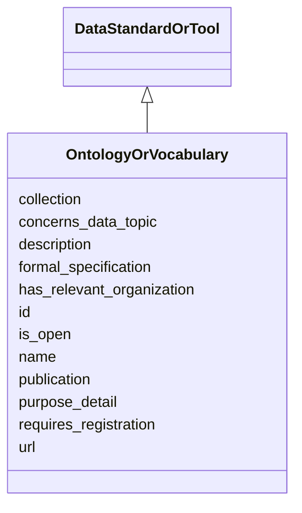

# Class: OntologyOrVocabulary
_A set of concepts and categories, potentially defined or accompanied by their hierarchical relationships._


URI: [STANDARDSDATASTANDARDORTOOL:OntologyOrVocabulary](https://w3id.org/bridge2ai/standards-datastandardortool-schema/OntologyOrVocabulary)





## Inheritance
* [NamedThing](NamedThing.md)
    * [DataStandardOrTool](DataStandardOrTool.md)
        * **OntologyOrVocabulary**


## Slots

| Name | Cardinality and Range | Description | Inheritance |
| ---  | --- | --- | --- |
| [concerns_data_topic](concerns_data_topic.md) | 0..1 <br/> [DataTopic](DataTopic.md) | Subject standard is generally applied in the context of object data topic | [DataStandardOrTool](DataStandardOrTool.md) |
| [purpose_detail](purpose_detail.md) | 0..1 <br/> NONE | Text description of the standard or tool | [DataStandardOrTool](DataStandardOrTool.md) |
| [name](name.md) | 0..1 <br/> NONE | A human-readable name for a thing | [NamedThing](NamedThing.md) |
| [formal_specification](formal_specification.md) | 0..1 <br/> [xsd:anyURI](xsd:anyURI) | Relevant code repository or other location for a formal specification of the ... | [DataStandardOrTool](DataStandardOrTool.md) |
| [has_relevant_organization](has_relevant_organization.md) | 0..1 <br/> [Organization](Organization.md) | Subject standard is managed or otherwise guided buy the object organization(s... | [DataStandardOrTool](DataStandardOrTool.md) |
| [description](description.md) | 0..1 <br/> NONE | A human-readable description for a thing | [NamedThing](NamedThing.md) |
| [is_open](is_open.md) | 0..1 <br/> [xsd:boolean](xsd:boolean) | Is the standard or tool FAIR and available free of cost? | [DataStandardOrTool](DataStandardOrTool.md) |
| [requires_registration](requires_registration.md) | 0..1 <br/> [xsd:boolean](xsd:boolean) | Does usage of the standard or tool require registrion of a user or group with... | [DataStandardOrTool](DataStandardOrTool.md) |
| [collection](collection.md) | 0..* <br/> [StandardsCollectionTag](StandardsCollectionTag.md) | Tags for specific sets of standards | [DataStandardOrTool](DataStandardOrTool.md) |
| [publication](publication.md) | 0..1 <br/> [xsd:anyURI](xsd:anyURI) | Relevant publication for the standard or tool | [DataStandardOrTool](DataStandardOrTool.md) |
| [url](url.md) | 0..1 <br/> [xsd:anyURI](xsd:anyURI) | URL for basic documentation of the standard or tool | [DataStandardOrTool](DataStandardOrTool.md) |
| [id](id.md) | 1..1 <br/> [xsd:anyURI](xsd:anyURI) | A unique identifier for a thing | [NamedThing](NamedThing.md) |


## Identifier and Mapping Information


### Schema Source


* from schema: https://w3id.org/bridge2ai/standards-datastandardortool-schema


## Mappings

| Mapping Type | Mapped Value |
| ---  | ---  |
| self | STANDARDSDATASTANDARDORTOOL:OntologyOrVocabulary |
| native | STANDARDSDATASTANDARDORTOOL:OntologyOrVocabulary |


## LinkML Source

<!-- TODO: investigate https://stackoverflow.com/questions/37606292/how-to-create-tabbed-code-blocks-in-mkdocs-or-sphinx -->

### Direct

<details>
```yaml
name: OntologyOrVocabulary
description: A set of concepts and categories, potentially defined or accompanied
  by their hierarchical relationships.
from_schema: https://w3id.org/bridge2ai/standards-datastandardortool-schema
rank: 1000
is_a: DataStandardOrTool

```
</details>

### Induced

<details>
```yaml
name: OntologyOrVocabulary
description: A set of concepts and categories, potentially defined or accompanied
  by their hierarchical relationships.
from_schema: https://w3id.org/bridge2ai/standards-datastandardortool-schema
rank: 1000
is_a: DataStandardOrTool
attributes:
  collection:
    name: collection
    description: Tags for specific sets of standards.
    from_schema: https://w3id.org/bridge2ai/standards-datastandardortool-schema
    rank: 1000
    is_a: node property
    domain: NamedThing
    multivalued: true
    alias: collection
    owner: OntologyOrVocabulary
    domain_of:
    - DataStandardOrTool
    range: StandardsCollectionTag
  concerns data topic:
    name: concerns data topic
    description: Subject standard is generally applied in the context of object data
      topic.
    from_schema: https://w3id.org/bridge2ai/standards-datastandardortool-schema
    rank: 1000
    is_a: related to
    domain: DataStandardOrTool
    multivalued: true
    inherited: true
    alias: concerns_data_topic
    owner: OntologyOrVocabulary
    domain_of:
    - DataStandardOrTool
    range: DataTopic
  has relevant organization:
    name: has relevant organization
    description: Subject standard is managed or otherwise guided buy the object organization(s).
    from_schema: https://w3id.org/bridge2ai/standards-datastandardortool-schema
    rank: 1000
    is_a: related to
    domain: DataStandardOrTool
    multivalued: true
    inherited: true
    alias: has_relevant_organization
    owner: OntologyOrVocabulary
    domain_of:
    - DataStandardOrTool
    range: Organization
  purpose_detail:
    name: purpose_detail
    description: Text description of the standard or tool.
    from_schema: https://w3id.org/bridge2ai/standards-datastandardortool-schema
    rank: 1000
    is_a: node property
    domain: NamedThing
    alias: purpose_detail
    owner: OntologyOrVocabulary
    domain_of:
    - DataStandardOrTool
  is_open:
    name: is_open
    description: Is the standard or tool FAIR and available free of cost?
    from_schema: https://w3id.org/bridge2ai/standards-datastandardortool-schema
    rank: 1000
    is_a: node property
    domain: NamedThing
    alias: is_open
    owner: OntologyOrVocabulary
    domain_of:
    - DataStandardOrTool
    range: boolean
  requires_registration:
    name: requires_registration
    description: Does usage of the standard or tool require registrion of a user or
      group with some organization or managerial body?
    from_schema: https://w3id.org/bridge2ai/standards-datastandardortool-schema
    rank: 1000
    is_a: node property
    domain: NamedThing
    alias: requires_registration
    owner: OntologyOrVocabulary
    domain_of:
    - DataStandardOrTool
    range: boolean
  url:
    name: url
    description: URL for basic documentation of the standard or tool.
    from_schema: https://w3id.org/bridge2ai/standards-datastandardortool-schema
    rank: 1000
    is_a: node property
    domain: NamedThing
    alias: url
    owner: OntologyOrVocabulary
    domain_of:
    - DataStandardOrTool
    range: uriorcurie
  publication:
    name: publication
    description: Relevant publication for the standard or tool. Prefer a DOI or PUBMED.
    from_schema: https://w3id.org/bridge2ai/standards-datastandardortool-schema
    rank: 1000
    is_a: node property
    domain: NamedThing
    alias: publication
    owner: OntologyOrVocabulary
    domain_of:
    - DataStandardOrTool
    range: uriorcurie
  formal_specification:
    name: formal_specification
    description: Relevant code repository or other location for a formal specification
      of the standard or tool. Often a URL, particularly to a Git repository.
    from_schema: https://w3id.org/bridge2ai/standards-datastandardortool-schema
    rank: 1000
    is_a: node property
    domain: NamedThing
    alias: formal_specification
    owner: OntologyOrVocabulary
    domain_of:
    - DataStandardOrTool
    range: uriorcurie
  id:
    name: id
    description: A unique identifier for a thing.
    from_schema: https://w3id.org/bridge2ai/standards-schema
    rank: 1000
    slot_uri: schema:identifier
    identifier: true
    alias: id
    owner: OntologyOrVocabulary
    domain_of:
    - NamedThing
    range: uriorcurie
    required: true
  name:
    name: name
    description: A human-readable name for a thing.
    from_schema: https://w3id.org/bridge2ai/standards-schema
    rank: 1000
    slot_uri: schema:name
    alias: name
    owner: OntologyOrVocabulary
    domain_of:
    - NamedThing
  description:
    name: description
    description: A human-readable description for a thing.
    from_schema: https://w3id.org/bridge2ai/standards-schema
    rank: 1000
    slot_uri: schema:description
    alias: description
    owner: OntologyOrVocabulary
    domain_of:
    - NamedThing

```
</details>