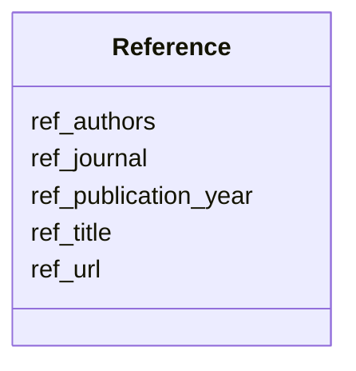

# Class: Reference 


_A bibliographic reference to a publication, preprint, or other citable resource._


URI: [https://w3id.org/bridge2ai/standards-schema-all/Reference](https://w3id.org/bridge2ai/standards-schema-all/Reference)





<!-- no inheritance hierarchy -->


## Slots

| Name | Cardinality and Range | Description | Inheritance |
| ---  | --- | --- | --- |
| [ref_url](ref_url.md) | 0..1 <br/> [Uriorcurie](Uriorcurie.md) | URL of the referenced publication, preprint, or other citable resource | direct |
| [ref_title](ref_title.md) | 0..1 <br/> [String](String.md) | Title of the referenced publication, preprint, or other citable resource | direct |
| [ref_authors](ref_authors.md) | * <br/> [String](String.md) | List of authors of the referenced publication, preprint, or other citable res... | direct |
| [ref_publication_year](ref_publication_year.md) | 0..1 <br/> [Integer](Integer.md) | Year of publication of the referenced publication, preprint, or other citable... | direct |
| [ref_journal](ref_journal.md) | 0..1 <br/> [String](String.md) | Journal or venue of the referenced publication, preprint, or other citable re... | direct |


## Usages

| used by | used in | type | used |
| ---  | --- | --- | --- |
| [Application](Application.md) | [references](references.md) | range | [Reference](Reference.md) |
| [Reference](Reference.md) | [ref_url](ref_url.md) | domain | [Reference](Reference.md) |
| [Reference](Reference.md) | [ref_title](ref_title.md) | domain | [Reference](Reference.md) |
| [Reference](Reference.md) | [ref_authors](ref_authors.md) | domain | [Reference](Reference.md) |
| [Reference](Reference.md) | [ref_publication_year](ref_publication_year.md) | domain | [Reference](Reference.md) |
| [Reference](Reference.md) | [ref_journal](ref_journal.md) | domain | [Reference](Reference.md) |
| [DataStandardOrTool](DataStandardOrTool.md) | [publication](publication.md) | range | [Reference](Reference.md) |
| [DataStandard](DataStandard.md) | [publication](publication.md) | range | [Reference](Reference.md) |
| [BiomedicalStandard](BiomedicalStandard.md) | [publication](publication.md) | range | [Reference](Reference.md) |
| [Registry](Registry.md) | [publication](publication.md) | range | [Reference](Reference.md) |
| [OntologyOrVocabulary](OntologyOrVocabulary.md) | [publication](publication.md) | range | [Reference](Reference.md) |
| [ModelRepository](ModelRepository.md) | [publication](publication.md) | range | [Reference](Reference.md) |
| [SoftwareOrTool](SoftwareOrTool.md) | [publication](publication.md) | range | [Reference](Reference.md) |
| [ReferenceImplementation](ReferenceImplementation.md) | [publication](publication.md) | range | [Reference](Reference.md) |
| [TrainingProgram](TrainingProgram.md) | [publication](publication.md) | range | [Reference](Reference.md) |


## Identifier and Mapping Information


### Schema Source


* from schema: https://w3id.org/bridge2ai/standards-schema-all


## Mappings

| Mapping Type | Mapped Value |
| ---  | ---  |
| self | https://w3id.org/bridge2ai/standards-schema-all/Reference |
| native | https://w3id.org/bridge2ai/standards-schema-all/Reference |


## LinkML Source

<!-- TODO: investigate https://stackoverflow.com/questions/37606292/how-to-create-tabbed-code-blocks-in-mkdocs-or-sphinx -->

### Direct

<details>
```yaml
name: Reference
description: A bibliographic reference to a publication, preprint, or other citable
  resource.
from_schema: https://w3id.org/bridge2ai/standards-schema-all
slots:
- ref_url
- ref_title
- ref_authors
- ref_publication_year
- ref_journal

```
</details>

### Induced

<details>
```yaml
name: Reference
description: A bibliographic reference to a publication, preprint, or other citable
  resource.
from_schema: https://w3id.org/bridge2ai/standards-schema-all
attributes:
  ref_url:
    name: ref_url
    description: URL of the referenced publication, preprint, or other citable resource.
      This will often be a DOI in URL form.
    from_schema: https://w3id.org/bridge2ai/standards-schema-all
    rank: 1000
    domain: Reference
    alias: ref_url
    owner: Reference
    domain_of:
    - Reference
    range: uriorcurie
  ref_title:
    name: ref_title
    description: Title of the referenced publication, preprint, or other citable resource.
    from_schema: https://w3id.org/bridge2ai/standards-schema-all
    rank: 1000
    domain: Reference
    alias: ref_title
    owner: Reference
    domain_of:
    - Reference
    range: string
  ref_authors:
    name: ref_authors
    description: List of authors of the referenced publication, preprint, or other
      citable resource. Format as surname(s) given name initials, e.g., "Brockheimer
      J", "Gudmundsdottir JF".
    from_schema: https://w3id.org/bridge2ai/standards-schema-all
    rank: 1000
    domain: Reference
    alias: ref_authors
    owner: Reference
    domain_of:
    - Reference
    range: string
    multivalued: true
  ref_publication_year:
    name: ref_publication_year
    description: Year of publication of the referenced publication, preprint, or other
      citable resource. Use four-digit year format (e.g., 2023).
    from_schema: https://w3id.org/bridge2ai/standards-schema-all
    rank: 1000
    domain: Reference
    alias: ref_publication_year
    owner: Reference
    domain_of:
    - Reference
    range: integer
  ref_journal:
    name: ref_journal
    description: Journal or venue of the referenced publication, preprint, or other
      citable resource. Follow the NLM Catalog journal title abbreviations where possible
      (e.g., J Biol Chem).
    from_schema: https://w3id.org/bridge2ai/standards-schema-all
    rank: 1000
    domain: Reference
    alias: ref_journal
    owner: Reference
    domain_of:
    - Reference
    range: string

```
</details>