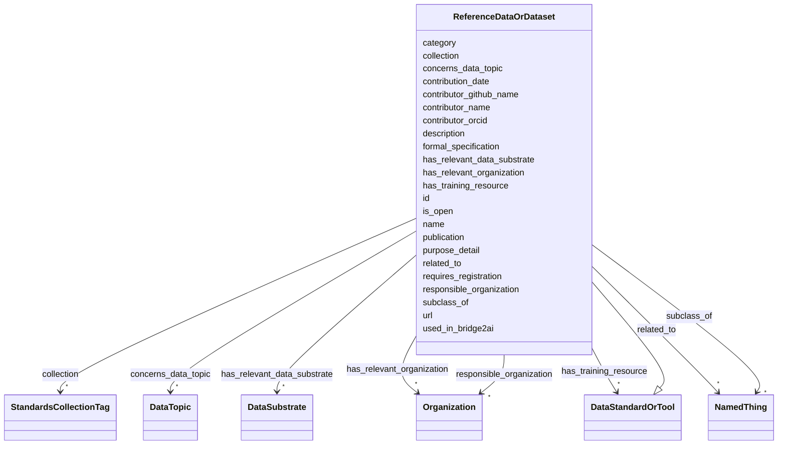

# Class: ReferenceDataOrDataset 


_Represents a resource in the Bridge2AI Standards Registry serving as a standardized, reusable data source._


URI: [https://w3id.org/bridge2ai/standards-schema-all/ReferenceDataOrDataset](https://w3id.org/bridge2ai/standards-schema-all/ReferenceDataOrDataset)





## Inheritance
* [NamedThing](NamedThing.md)
    * [DataStandardOrTool](DataStandardOrTool.md)
        * **ReferenceDataOrDataset**


## Slots

| Name | Cardinality and Range | Description | Inheritance |
| ---  | --- | --- | --- |
| [collection](collection.md) | * <br/> [StandardsCollectionTag](StandardsCollectionTag.md) | Tags for specific sets of standards | [DataStandardOrTool](DataStandardOrTool.md) |
| [concerns_data_topic](concerns_data_topic.md) | * <br/> [DataTopic](DataTopic.md) | Subject standard is generally applied in the context of object data topic | [DataStandardOrTool](DataStandardOrTool.md) |
| [has_relevant_organization](has_relevant_organization.md) | * <br/> [Organization](Organization.md) | Subject standard has some relationship to the object organization(s), includi... | [DataStandardOrTool](DataStandardOrTool.md) |
| [has_training_resource](has_training_resource.md) | * <br/> [DataStandardOrTool](DataStandardOrTool.md) | Relevant training resources, standard usage manuals, or other documentation f... | [DataStandardOrTool](DataStandardOrTool.md) |
| [purpose_detail](purpose_detail.md) | 0..1 <br/> [String](String.md) | Text description of the standard or tool | [DataStandardOrTool](DataStandardOrTool.md) |
| [is_open](is_open.md) | 0..1 <br/> [Boolean](Boolean.md) | Is the standard or tool FAIR and available free of cost? | [DataStandardOrTool](DataStandardOrTool.md) |
| [requires_registration](requires_registration.md) | 0..1 <br/> [Boolean](Boolean.md) | Does usage of the standard or tool require registration of a user or group wi... | [DataStandardOrTool](DataStandardOrTool.md) |
| [url](url.md) | 0..1 <br/> [Uriorcurie](Uriorcurie.md) | URL for basic documentation of the standard or tool | [DataStandardOrTool](DataStandardOrTool.md) |
| [publication](publication.md) | 0..1 <br/> [Uriorcurie](Uriorcurie.md) | Relevant publication for the standard or tool | [DataStandardOrTool](DataStandardOrTool.md) |
| [formal_specification](formal_specification.md) | 0..1 <br/> [Uriorcurie](Uriorcurie.md) | Relevant code repository or other location for a formal specification of the ... | [DataStandardOrTool](DataStandardOrTool.md) |
| [responsible_organization](responsible_organization.md) | * <br/> [Organization](Organization.md) | Organization(s) responsible for providing and/or supporting the standard or t... | [DataStandardOrTool](DataStandardOrTool.md) |
| [has_relevant_data_substrate](has_relevant_data_substrate.md) | * <br/> [DataSubstrate](DataSubstrate.md) | Subject standard has some relationship to the object data substrate(s), inclu... | [DataStandardOrTool](DataStandardOrTool.md) |
| [id](id.md) | 1 <br/> [Uriorcurie](Uriorcurie.md) | A unique identifier for a thing | [NamedThing](NamedThing.md) |
| [category](category.md) | 0..1 <br/> [CategoryType](CategoryType.md) | CURIE for the high level ontology class in which this entity is categorized | [NamedThing](NamedThing.md) |
| [name](name.md) | 0..1 <br/> [String](String.md) | A human-readable name for a thing | [NamedThing](NamedThing.md) |
| [description](description.md) | 0..1 <br/> [String](String.md) | A human-readable description for a thing | [NamedThing](NamedThing.md) |
| [subclass_of](subclass_of.md) | * <br/> [NamedThing](NamedThing.md) | Holds between two classes where the domain class is a specialization of the r... | [NamedThing](NamedThing.md) |
| [related_to](related_to.md) | * <br/> [NamedThing](NamedThing.md) | A relationship that is asserted between two named things | [NamedThing](NamedThing.md) |
| [contributor_name](contributor_name.md) | 0..1 <br/> [String](String.md) | The name of the person who added this node | [NamedThing](NamedThing.md) |
| [contributor_github_name](contributor_github_name.md) | 0..1 <br/> [String](String.md) | The name of the github user who added this node | [NamedThing](NamedThing.md) |
| [contributor_orcid](contributor_orcid.md) | 0..1 <br/> [Uriorcurie](Uriorcurie.md) | The ORCiD of the person who added this node | [NamedThing](NamedThing.md) |
| [contribution_date](contribution_date.md) | 0..1 <br/> [Date](Date.md) | The date on which the node was added | [NamedThing](NamedThing.md) |
| [used_in_bridge2ai](used_in_bridge2ai.md) | 0..1 <br/> [Boolean](Boolean.md) | True if the entity is used, developed, or otherwise related to work in the Br... | [NamedThing](NamedThing.md) |


## Identifier and Mapping Information


### Schema Source


* from schema: https://w3id.org/bridge2ai/standards-schema-all


## Mappings

| Mapping Type | Mapped Value |
| ---  | ---  |
| self | https://w3id.org/bridge2ai/standards-schema-all/ReferenceDataOrDataset |
| native | https://w3id.org/bridge2ai/standards-schema-all/ReferenceDataOrDataset |


## LinkML Source

<!-- TODO: investigate https://stackoverflow.com/questions/37606292/how-to-create-tabbed-code-blocks-in-mkdocs-or-sphinx -->

### Direct

<details>
```yaml
name: ReferenceDataOrDataset
description: Represents a resource in the Bridge2AI Standards Registry serving as
  a standardized, reusable data source.
from_schema: https://w3id.org/bridge2ai/standards-schema-all
is_a: DataStandardOrTool

```
</details>

### Induced

<details>
```yaml
name: ReferenceDataOrDataset
description: Represents a resource in the Bridge2AI Standards Registry serving as
  a standardized, reusable data source.
from_schema: https://w3id.org/bridge2ai/standards-schema-all
is_a: DataStandardOrTool
attributes:
  collection:
    name: collection
    description: Tags for specific sets of standards.
    from_schema: https://w3id.org/bridge2ai/standards-schema-all
    rank: 1000
    is_a: node_property
    domain: NamedThing
    alias: collection
    owner: ReferenceDataOrDataset
    domain_of:
    - DataStandardOrTool
    range: StandardsCollectionTag
    multivalued: true
  concerns_data_topic:
    name: concerns_data_topic
    description: Subject standard is generally applied in the context of object data
      topic.
    from_schema: https://w3id.org/bridge2ai/standards-schema-all
    rank: 1000
    is_a: related_to
    domain: DataStandardOrTool
    inherited: true
    alias: concerns_data_topic
    owner: ReferenceDataOrDataset
    domain_of:
    - DataStandardOrTool
    range: DataTopic
    multivalued: true
  has_relevant_organization:
    name: has_relevant_organization
    description: Subject standard has some relationship to the object organization(s),
      including as a user. This is distinct from the responsible organization, which
      is the group providing or supporting the standard or tool.
    from_schema: https://w3id.org/bridge2ai/standards-schema-all
    rank: 1000
    is_a: related_to
    domain: DataStandardOrTool
    inherited: true
    alias: has_relevant_organization
    owner: ReferenceDataOrDataset
    domain_of:
    - DataStandardOrTool
    range: Organization
    multivalued: true
  has_training_resource:
    name: has_training_resource
    description: Relevant training resources, standard usage manuals, or other documentation
      for the standard or tool.
    from_schema: https://w3id.org/bridge2ai/standards-schema-all
    rank: 1000
    is_a: node_property
    domain: NamedThing
    alias: has_training_resource
    owner: ReferenceDataOrDataset
    domain_of:
    - DataStandardOrTool
    range: DataStandardOrTool
    multivalued: true
  purpose_detail:
    name: purpose_detail
    description: Text description of the standard or tool.
    from_schema: https://w3id.org/bridge2ai/standards-schema-all
    rank: 1000
    is_a: node_property
    domain: NamedThing
    alias: purpose_detail
    owner: ReferenceDataOrDataset
    domain_of:
    - DataStandardOrTool
    range: string
  is_open:
    name: is_open
    description: Is the standard or tool FAIR and available free of cost?
    from_schema: https://w3id.org/bridge2ai/standards-schema-all
    rank: 1000
    is_a: node_property
    domain: NamedThing
    alias: is_open
    owner: ReferenceDataOrDataset
    domain_of:
    - DataStandardOrTool
    range: boolean
  requires_registration:
    name: requires_registration
    description: Does usage of the standard or tool require registration of a user
      or group with some organization or managerial body?
    from_schema: https://w3id.org/bridge2ai/standards-schema-all
    rank: 1000
    is_a: node_property
    domain: NamedThing
    alias: requires_registration
    owner: ReferenceDataOrDataset
    domain_of:
    - DataStandardOrTool
    range: boolean
  url:
    name: url
    description: URL for basic documentation of the standard or tool.
    from_schema: https://w3id.org/bridge2ai/standards-schema-all
    rank: 1000
    is_a: node_property
    domain: NamedThing
    alias: url
    owner: ReferenceDataOrDataset
    domain_of:
    - DataStandardOrTool
    - Organization
    range: uriorcurie
  publication:
    name: publication
    description: Relevant publication for the standard or tool. Prefer a DOI or PUBMED.
    from_schema: https://w3id.org/bridge2ai/standards-schema-all
    rank: 1000
    is_a: node_property
    domain: NamedThing
    alias: publication
    owner: ReferenceDataOrDataset
    domain_of:
    - DataStandardOrTool
    range: uriorcurie
  formal_specification:
    name: formal_specification
    description: Relevant code repository or other location for a formal specification
      of the standard or tool. Often a URL, particularly to a Git repository.
    from_schema: https://w3id.org/bridge2ai/standards-schema-all
    rank: 1000
    is_a: node_property
    domain: NamedThing
    alias: formal_specification
    owner: ReferenceDataOrDataset
    domain_of:
    - DataStandardOrTool
    range: uriorcurie
  responsible_organization:
    name: responsible_organization
    description: Organization(s) responsible for providing and/or supporting the standard
      or tool.
    from_schema: https://w3id.org/bridge2ai/standards-schema-all
    rank: 1000
    is_a: node_property
    domain: DataStandardOrTool
    alias: responsible_organization
    owner: ReferenceDataOrDataset
    domain_of:
    - DataStandardOrTool
    range: Organization
    multivalued: true
  has_relevant_data_substrate:
    name: has_relevant_data_substrate
    description: Subject standard has some relationship to the object data substrate(s),
      including whether it is intended to be used with the data substrate, or whether
      it is implemented through the data substrate.
    from_schema: https://w3id.org/bridge2ai/standards-schema-all
    rank: 1000
    is_a: related_to
    domain: DataStandardOrTool
    inherited: true
    alias: has_relevant_data_substrate
    owner: ReferenceDataOrDataset
    domain_of:
    - DataStandardOrTool
    range: DataSubstrate
    multivalued: true
  id:
    name: id
    description: A unique identifier for a thing.
    from_schema: https://w3id.org/bridge2ai/standards-schema-all
    rank: 1000
    slot_uri: schema:identifier
    identifier: true
    alias: id
    owner: ReferenceDataOrDataset
    domain_of:
    - NamedThing
    range: uriorcurie
    required: true
  category:
    name: category
    description: CURIE for the high level ontology class in which this entity is categorized.
      Corresponds to the label for the entity type class, e.g., "B2AI_STANDARD:DataStandard".
    from_schema: https://w3id.org/bridge2ai/standards-schema-all
    rank: 1000
    is_a: type
    domain: NamedThing
    designates_type: true
    alias: category
    owner: ReferenceDataOrDataset
    domain_of:
    - NamedThing
    range: category_type
  name:
    name: name
    description: A human-readable name for a thing.
    from_schema: https://w3id.org/bridge2ai/standards-schema-all
    rank: 1000
    slot_uri: schema:name
    alias: name
    owner: ReferenceDataOrDataset
    domain_of:
    - NamedThing
    range: string
  description:
    name: description
    description: A human-readable description for a thing.
    from_schema: https://w3id.org/bridge2ai/standards-schema-all
    rank: 1000
    slot_uri: schema:description
    alias: description
    owner: ReferenceDataOrDataset
    domain_of:
    - NamedThing
    range: string
  subclass_of:
    name: subclass_of
    description: Holds between two classes where the domain class is a specialization
      of the range class.
    from_schema: https://w3id.org/bridge2ai/standards-schema-all
    exact_mappings:
    - rdfs:subClassOf
    - MESH:isa
    narrow_mappings:
    - rdfs:subPropertyOf
    rank: 1000
    is_a: related_to
    domain: NamedThing
    inherited: true
    alias: subclass_of
    owner: ReferenceDataOrDataset
    domain_of:
    - NamedThing
    range: NamedThing
    multivalued: true
  related_to:
    name: related_to
    description: A relationship that is asserted between two named things.
    from_schema: https://w3id.org/bridge2ai/standards-schema-all
    rank: 1000
    domain: NamedThing
    inherited: true
    alias: related_to
    owner: ReferenceDataOrDataset
    domain_of:
    - NamedThing
    - Organization
    symmetric: true
    range: NamedThing
    multivalued: true
  contributor_name:
    name: contributor_name
    description: The name of the person who added this node.
    from_schema: https://w3id.org/bridge2ai/standards-schema-all
    rank: 1000
    is_a: node_property
    domain: NamedThing
    alias: contributor_name
    owner: ReferenceDataOrDataset
    domain_of:
    - NamedThing
    range: string
  contributor_github_name:
    name: contributor_github_name
    description: The name of the github user who added this node.
    from_schema: https://w3id.org/bridge2ai/standards-schema-all
    rank: 1000
    is_a: node_property
    domain: NamedThing
    alias: contributor_github_name
    owner: ReferenceDataOrDataset
    domain_of:
    - NamedThing
    range: string
  contributor_orcid:
    name: contributor_orcid
    description: The ORCiD of the person who added this node.
    examples:
    - value: ORCID:0000-0001-1234-5678
    from_schema: https://w3id.org/bridge2ai/standards-schema-all
    rank: 1000
    is_a: node_property
    domain: NamedThing
    alias: contributor_orcid
    owner: ReferenceDataOrDataset
    domain_of:
    - NamedThing
    range: uriorcurie
  contribution_date:
    name: contribution_date
    description: The date on which the node was added.
    examples:
    - value: '2023-03-20'
    from_schema: https://w3id.org/bridge2ai/standards-schema-all
    rank: 1000
    is_a: node_property
    domain: NamedThing
    alias: contribution_date
    owner: ReferenceDataOrDataset
    domain_of:
    - NamedThing
    range: date
  used_in_bridge2ai:
    name: used_in_bridge2ai
    description: True if the entity is used, developed, or otherwise related to work
      in the Bridge2AI consortium. If false, the entity is not explicitly related
      to Bridge2AI. If not specified, it is not known if the entity is related to
      Bridge2AI.
    from_schema: https://w3id.org/bridge2ai/standards-schema-all
    rank: 1000
    is_a: node_property
    domain: NamedThing
    alias: used_in_bridge2ai
    owner: ReferenceDataOrDataset
    domain_of:
    - NamedThing
    range: boolean

```
</details>