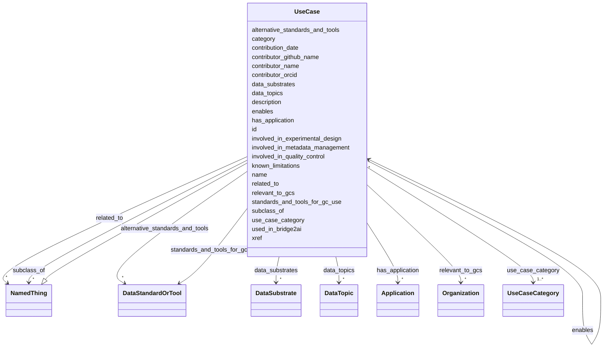

# Class: UseCase 


_Represents a use case for Bridge2AI standards._


URI: [https://w3id.org/bridge2ai/standards-schema-all/UseCase](https://w3id.org/bridge2ai/standards-schema-all/UseCase)





## Inheritance
* [NamedThing](NamedThing.md)
    * **UseCase**


## Slots

| Name | Cardinality and Range | Description | Inheritance |
| ---  | --- | --- | --- |
| [use_case_category](use_case_category.md) | 1..* <br/> [UseCaseCategory](UseCaseCategory.md) | Category of the UseCase | direct |
| [known_limitations](known_limitations.md) | 0..1 <br/> [String](String.md) | Any current obstacles to implementing this use case | direct |
| [relevant_to_gcs](relevant_to_gcs.md) | * <br/> [Organization](Organization.md) | Bridge2AI Grand Challenges related to this use case, generally because they a... | direct |
| [data_topics](data_topics.md) | * <br/> [DataTopic](DataTopic.md) | Relevance of the use case to one or more data topics | direct |
| [data_substrates](data_substrates.md) | * <br/> [DataSubstrate](DataSubstrate.md) | Relevance of the use case to one or more data substrates | direct |
| [standards_and_tools_for_gc_use](standards_and_tools_for_gc_use.md) | * <br/> [DataStandardOrTool](DataStandardOrTool.md) | List of identifiers of standards and tools; those planned to be used, or alre... | direct |
| [alternative_standards_and_tools](alternative_standards_and_tools.md) | * <br/> [DataStandardOrTool](DataStandardOrTool.md) | List of identifiers of standards and tools; those not explicitly planned to b... | direct |
| [enables](enables.md) | * <br/> [UseCase](UseCase.md) | List of other use case(s) this use case supports or makes possible | direct |
| [involved_in_experimental_design](involved_in_experimental_design.md) | 0..1 <br/> [Boolean](Boolean.md) | True if use case is likely to be implemented as part of an experimental proce... | direct |
| [involved_in_metadata_management](involved_in_metadata_management.md) | 0..1 <br/> [Boolean](Boolean.md) | True if use case is likely to be implemented as part of metadata indexing, sa... | direct |
| [involved_in_quality_control](involved_in_quality_control.md) | 0..1 <br/> [Boolean](Boolean.md) | A value of True indicates a use case is likely to be implemented as part of d... | direct |
| [xref](xref.md) | * <br/> [Uriorcurie](Uriorcurie.md) | URI of corresponding class in an ontology of experimental procedures, in CURI... | direct |
| [id](id.md) | 1 <br/> [Uriorcurie](Uriorcurie.md) | A unique identifier for a thing | [NamedThing](NamedThing.md) |
| [category](category.md) | 0..1 <br/> [CategoryType](CategoryType.md) | CURIE for the high level ontology class in which this entity is categorized | [NamedThing](NamedThing.md) |
| [name](name.md) | 0..1 <br/> [String](String.md) | A human-readable name for a thing | [NamedThing](NamedThing.md) |
| [description](description.md) | 0..1 <br/> [String](String.md) | A human-readable description for a thing | [NamedThing](NamedThing.md) |
| [subclass_of](subclass_of.md) | * <br/> [NamedThing](NamedThing.md) | Holds between two classes where the domain class is a specialization of the r... | [NamedThing](NamedThing.md) |
| [related_to](related_to.md) | * <br/> [NamedThing](NamedThing.md) | A relationship that is asserted between two named things | [NamedThing](NamedThing.md) |
| [contributor_name](contributor_name.md) | 0..1 <br/> [String](String.md) | The name of the person who added this node | [NamedThing](NamedThing.md) |
| [contributor_github_name](contributor_github_name.md) | 0..1 <br/> [String](String.md) | The name of the github user who added this node | [NamedThing](NamedThing.md) |
| [contributor_orcid](contributor_orcid.md) | 0..1 <br/> [Uriorcurie](Uriorcurie.md) | The ORCiD of the person who added this node | [NamedThing](NamedThing.md) |
| [contribution_date](contribution_date.md) | 0..1 <br/> [Date](Date.md) | The date on which the node was added | [NamedThing](NamedThing.md) |
| [used_in_bridge2ai](used_in_bridge2ai.md) | 0..1 <br/> [Boolean](Boolean.md) | True if the entity is used, developed, or otherwise related to work in the Br... | [NamedThing](NamedThing.md) |
| [has_application](has_application.md) | * <br/> [Application](Application.md) | A list of one or more specific applications of this entity to a specific purp... | [NamedThing](NamedThing.md) |


## Usages

| used by | used in | type | used |
| ---  | --- | --- | --- |
| [UseCase](UseCase.md) | [enables](enables.md) | range | [UseCase](UseCase.md) |
| [UseCaseContainer](UseCaseContainer.md) | [use_cases](use_cases.md) | range | [UseCase](UseCase.md) |


## Identifier and Mapping Information


### Schema Source


* from schema: https://w3id.org/bridge2ai/standards-schema-all


## Mappings

| Mapping Type | Mapped Value |
| ---  | ---  |
| self | https://w3id.org/bridge2ai/standards-schema-all/UseCase |
| native | https://w3id.org/bridge2ai/standards-schema-all/UseCase |


## LinkML Source

<!-- TODO: investigate https://stackoverflow.com/questions/37606292/how-to-create-tabbed-code-blocks-in-mkdocs-or-sphinx -->

### Direct

<details>
```yaml
name: UseCase
description: Represents a use case for Bridge2AI standards.
from_schema: https://w3id.org/bridge2ai/standards-schema-all
is_a: NamedThing
slots:
- use_case_category
- known_limitations
- relevant_to_gcs
- data_topics
- data_substrates
- standards_and_tools_for_gc_use
- alternative_standards_and_tools
- enables
- involved_in_experimental_design
- involved_in_metadata_management
- involved_in_quality_control
- xref
slot_usage:
  use_case_category:
    name: use_case_category
    required: true

```
</details>

### Induced

<details>
```yaml
name: UseCase
description: Represents a use case for Bridge2AI standards.
from_schema: https://w3id.org/bridge2ai/standards-schema-all
is_a: NamedThing
slot_usage:
  use_case_category:
    name: use_case_category
    required: true
attributes:
  use_case_category:
    name: use_case_category
    description: Category of the UseCase. Not all projects will incorporate use cases
      in all categories. This is multivalued, as a use case may span categories.
    from_schema: https://w3id.org/bridge2ai/standards-schema-all
    rank: 1000
    is_a: node_property
    domain: NamedThing
    alias: use_case_category
    owner: UseCase
    domain_of:
    - UseCase
    range: UseCaseCategory
    required: true
    multivalued: true
  known_limitations:
    name: known_limitations
    description: Any current obstacles to implementing this use case. This could be
      a selection from one or more predefined categories including lack of standards,
      lack of relevant patient cohort, lack of funding, etc.
    from_schema: https://w3id.org/bridge2ai/standards-schema-all
    rank: 1000
    is_a: node_property
    domain: NamedThing
    alias: known_limitations
    owner: UseCase
    domain_of:
    - UseCase
    range: string
  relevant_to_gcs:
    name: relevant_to_gcs
    description: Bridge2AI Grand Challenges related to this use case, generally because
      they actively pursue this use case, or because they have investigated it in
      some manner. GCs should be identified by their Bridge2AI identifier, e.g., B2AI_ORG:117.
    from_schema: https://w3id.org/bridge2ai/standards-schema-all
    rank: 1000
    alias: relevant_to_gcs
    owner: UseCase
    domain_of:
    - UseCase
    range: Organization
    multivalued: true
  data_topics:
    name: data_topics
    description: Relevance of the use case to one or more data topics.
    from_schema: https://w3id.org/bridge2ai/standards-schema-all
    rank: 1000
    is_a: node_property
    domain: NamedThing
    alias: data_topics
    owner: UseCase
    domain_of:
    - UseCase
    range: DataTopic
    multivalued: true
  data_substrates:
    name: data_substrates
    description: Relevance of the use case to one or more data substrates.
    from_schema: https://w3id.org/bridge2ai/standards-schema-all
    rank: 1000
    is_a: node_property
    domain: NamedThing
    alias: data_substrates
    owner: UseCase
    domain_of:
    - UseCase
    range: DataSubstrate
    multivalued: true
  standards_and_tools_for_gc_use:
    name: standards_and_tools_for_gc_use
    description: List of identifiers of standards and tools; those planned to be used,
      or already in use, by one or more Bridge2AI GCs in addressing this use case,
      from those in the Standards Registry. If no value is provided here, the use
      case may not have a direct relationship to a standard or tool.
    from_schema: https://w3id.org/bridge2ai/standards-schema-all
    rank: 1000
    is_a: node_property
    domain: NamedThing
    alias: standards_and_tools_for_gc_use
    owner: UseCase
    domain_of:
    - UseCase
    range: DataStandardOrTool
    multivalued: true
  alternative_standards_and_tools:
    name: alternative_standards_and_tools
    description: List of identifiers of standards and tools; those not explicitly
      planned to be used, by one or more Bridge2AI GCs in addressing this use case
      but serving as viable alternatives, from those in the Standards Registry.
    from_schema: https://w3id.org/bridge2ai/standards-schema-all
    rank: 1000
    is_a: node_property
    domain: NamedThing
    alias: alternative_standards_and_tools
    owner: UseCase
    domain_of:
    - UseCase
    range: DataStandardOrTool
    multivalued: true
  enables:
    name: enables
    description: List of other use case(s) this use case supports or makes possible.
    from_schema: https://w3id.org/bridge2ai/standards-schema-all
    rank: 1000
    is_a: node_property
    domain: NamedThing
    alias: enables
    owner: UseCase
    domain_of:
    - UseCase
    range: UseCase
    multivalued: true
  involved_in_experimental_design:
    name: involved_in_experimental_design
    description: True if use case is likely to be implemented as part of an experimental
      procedure or collection of data to be used as part of an experiment.
    from_schema: https://w3id.org/bridge2ai/standards-schema-all
    rank: 1000
    is_a: node_property
    domain: NamedThing
    alias: involved_in_experimental_design
    owner: UseCase
    domain_of:
    - UseCase
    range: boolean
  involved_in_metadata_management:
    name: involved_in_metadata_management
    description: True if use case is likely to be implemented as part of metadata
      indexing, sample tracking, or any other storage of high-level data properties.
      Includes use cases in which metadata will be collected along with data.
    from_schema: https://w3id.org/bridge2ai/standards-schema-all
    rank: 1000
    is_a: node_property
    domain: NamedThing
    alias: involved_in_metadata_management
    owner: UseCase
    domain_of:
    - UseCase
    range: boolean
  involved_in_quality_control:
    name: involved_in_quality_control
    description: A value of True indicates a use case is likely to be implemented
      as part of data validation operations.
    from_schema: https://w3id.org/bridge2ai/standards-schema-all
    rank: 1000
    is_a: node_property
    domain: NamedThing
    alias: involved_in_quality_control
    owner: UseCase
    domain_of:
    - UseCase
    range: boolean
  xref:
    name: xref
    description: URI of corresponding class in an ontology of experimental procedures,
      in CURIE form.
    from_schema: https://w3id.org/bridge2ai/standards-schema-all
    aliases:
    - dbxref
    - Dbxref
    - DbXref
    rank: 1000
    is_a: node_property
    domain: NamedThing
    alias: xref
    owner: UseCase
    domain_of:
    - UseCase
    range: uriorcurie
    multivalued: true
  id:
    name: id
    description: A unique identifier for a thing.
    from_schema: https://w3id.org/bridge2ai/standards-schema-all
    rank: 1000
    slot_uri: schema:identifier
    identifier: true
    alias: id
    owner: UseCase
    domain_of:
    - NamedThing
    range: uriorcurie
    required: true
  category:
    name: category
    description: CURIE for the high level ontology class in which this entity is categorized.
      Corresponds to the label for the entity type class, e.g., "B2AI_STANDARD:DataStandard".
    from_schema: https://w3id.org/bridge2ai/standards-schema-all
    rank: 1000
    is_a: type
    domain: NamedThing
    designates_type: true
    alias: category
    owner: UseCase
    domain_of:
    - NamedThing
    range: category_type
  name:
    name: name
    description: A human-readable name for a thing.
    from_schema: https://w3id.org/bridge2ai/standards-schema-all
    rank: 1000
    slot_uri: schema:name
    alias: name
    owner: UseCase
    domain_of:
    - NamedThing
    range: string
  description:
    name: description
    description: A human-readable description for a thing.
    from_schema: https://w3id.org/bridge2ai/standards-schema-all
    rank: 1000
    slot_uri: schema:description
    alias: description
    owner: UseCase
    domain_of:
    - NamedThing
    range: string
  subclass_of:
    name: subclass_of
    description: Holds between two classes where the domain class is a specialization
      of the range class.
    from_schema: https://w3id.org/bridge2ai/standards-schema-all
    exact_mappings:
    - rdfs:subClassOf
    - MESH:isa
    narrow_mappings:
    - rdfs:subPropertyOf
    rank: 1000
    is_a: related_to
    domain: NamedThing
    inherited: true
    alias: subclass_of
    owner: UseCase
    domain_of:
    - NamedThing
    range: NamedThing
    multivalued: true
  related_to:
    name: related_to
    description: A relationship that is asserted between two named things.
    from_schema: https://w3id.org/bridge2ai/standards-schema-all
    rank: 1000
    domain: NamedThing
    inherited: true
    alias: related_to
    owner: UseCase
    domain_of:
    - NamedThing
    - Organization
    symmetric: true
    range: NamedThing
    multivalued: true
  contributor_name:
    name: contributor_name
    description: The name of the person who added this node.
    from_schema: https://w3id.org/bridge2ai/standards-schema-all
    rank: 1000
    is_a: node_property
    domain: NamedThing
    alias: contributor_name
    owner: UseCase
    domain_of:
    - NamedThing
    range: string
  contributor_github_name:
    name: contributor_github_name
    description: The name of the github user who added this node.
    from_schema: https://w3id.org/bridge2ai/standards-schema-all
    rank: 1000
    is_a: node_property
    domain: NamedThing
    alias: contributor_github_name
    owner: UseCase
    domain_of:
    - NamedThing
    range: string
  contributor_orcid:
    name: contributor_orcid
    description: The ORCiD of the person who added this node.
    examples:
    - value: ORCID:0000-0001-1234-5678
    from_schema: https://w3id.org/bridge2ai/standards-schema-all
    rank: 1000
    is_a: node_property
    domain: NamedThing
    alias: contributor_orcid
    owner: UseCase
    domain_of:
    - NamedThing
    range: uriorcurie
  contribution_date:
    name: contribution_date
    description: The date on which the node was added.
    examples:
    - value: '2023-03-20'
    from_schema: https://w3id.org/bridge2ai/standards-schema-all
    rank: 1000
    is_a: node_property
    domain: NamedThing
    alias: contribution_date
    owner: UseCase
    domain_of:
    - NamedThing
    range: date
  used_in_bridge2ai:
    name: used_in_bridge2ai
    description: True if the entity is used, developed, or otherwise related to work
      in the Bridge2AI consortium. If false, the entity is not explicitly related
      to Bridge2AI. If not specified, it is not known if the entity is related to
      Bridge2AI.
    from_schema: https://w3id.org/bridge2ai/standards-schema-all
    rank: 1000
    is_a: node_property
    domain: NamedThing
    alias: used_in_bridge2ai
    owner: UseCase
    domain_of:
    - NamedThing
    range: boolean
  has_application:
    name: has_application
    description: A list of one or more specific applications of this entity to a specific
      purpose.
    from_schema: https://w3id.org/bridge2ai/standards-schema-all
    rank: 1000
    domain: NamedThing
    alias: has_application
    owner: UseCase
    domain_of:
    - NamedThing
    range: Application
    multivalued: true
    inlined: true
    inlined_as_list: true

```
</details>