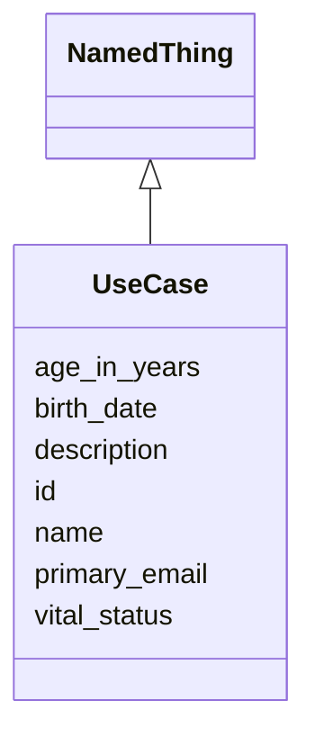

# Class: UseCase
_Represents a UseCase_


URI: [standards_usecase_schema:UseCase](https://w3id.org/bridge2ai/standards-usecase-schema/UseCase)





## Inheritance
* [NamedThing](NamedThing.md)
    * **UseCase**


## Slots

| Name | Cardinality and Range | Description | Inheritance |
| ---  | --- | --- | --- |
| [primary_email](primary_email.md) | 0..1 <br/> NONE | The main email address of a person | direct |
| [birth_date](birth_date.md) | 0..1 <br/> [xsd:date](xsd:date) | Date on which a person is born | direct |
| [age_in_years](age_in_years.md) | 0..1 <br/> [xsd:integer](xsd:integer) | Number of years since birth | direct |
| [vital_status](vital_status.md) | 0..1 <br/> [PersonStatus](PersonStatus.md) | living or dead status | direct |
| [name](name.md) | 0..1 <br/> NONE | A human-readable name for a thing | [NamedThing](NamedThing.md) |
| [description](description.md) | 0..1 <br/> NONE | A human-readable description for a thing | [NamedThing](NamedThing.md) |
| [id](id.md) | 1..1 <br/> [xsd:anyURI](xsd:anyURI) | A unique identifier for a thing | [NamedThing](NamedThing.md) |


## Usages

| used by | used in | type | used |
| ---  | --- | --- | --- |
| [UseCaseCollection](UseCaseCollection.md) | [entries](entries.md) | range | [UseCase](UseCase.md) |


## Identifier and Mapping Information


### Schema Source


* from schema: https://w3id.org/bridge2ai/standards-usecase-schema


## Mappings

| Mapping Type | Mapped Value |
| ---  | ---  |
| self | standards_usecase_schema:UseCase |
| native | standards_usecase_schema:UseCase |


## LinkML Source

<!-- TODO: investigate https://stackoverflow.com/questions/37606292/how-to-create-tabbed-code-blocks-in-mkdocs-or-sphinx -->

### Direct

<details>
```yaml
name: UseCase
description: Represents a UseCase
from_schema: https://w3id.org/bridge2ai/standards-usecase-schema
rank: 1000
is_a: NamedThing
slots:
- primary_email
- birth_date
- age_in_years
- vital_status
slot_usage:
  primary_email:
    name: primary_email
    domain_of:
    - UseCase
    - UseCase
    pattern: ^\S+@[\S+\.]+\S+

```
</details>

### Induced

<details>
```yaml
name: UseCase
description: Represents a UseCase
from_schema: https://w3id.org/bridge2ai/standards-usecase-schema
rank: 1000
is_a: NamedThing
slot_usage:
  primary_email:
    name: primary_email
    domain_of:
    - UseCase
    - UseCase
    pattern: ^\S+@[\S+\.]+\S+
attributes:
  primary_email:
    name: primary_email
    description: The main email address of a person
    from_schema: https://w3id.org/bridge2ai/standards-usecase-schema
    rank: 1000
    slot_uri: schema:email
    alias: primary_email
    owner: UseCase
    domain_of:
    - UseCase
    - UseCase
    range: string
    pattern: ^\S+@[\S+\.]+\S+
  birth_date:
    name: birth_date
    description: Date on which a person is born
    from_schema: https://w3id.org/bridge2ai/standards-usecase-schema
    rank: 1000
    slot_uri: schema:birthDate
    alias: birth_date
    owner: UseCase
    domain_of:
    - UseCase
    range: date
  age_in_years:
    name: age_in_years
    description: Number of years since birth
    from_schema: https://w3id.org/bridge2ai/standards-usecase-schema
    rank: 1000
    alias: age_in_years
    owner: UseCase
    domain_of:
    - UseCase
    range: integer
  vital_status:
    name: vital_status
    description: living or dead status
    from_schema: https://w3id.org/bridge2ai/standards-usecase-schema
    rank: 1000
    alias: vital_status
    owner: UseCase
    domain_of:
    - UseCase
    range: PersonStatus
  id:
    name: id
    description: A unique identifier for a thing
    from_schema: https://w3id.org/bridge2ai/standards-usecase-schema
    rank: 1000
    slot_uri: schema:identifier
    identifier: true
    alias: id
    owner: UseCase
    domain_of:
    - NamedThing
    range: uriorcurie
  name:
    name: name
    description: A human-readable name for a thing
    from_schema: https://w3id.org/bridge2ai/standards-usecase-schema
    rank: 1000
    slot_uri: schema:name
    alias: name
    owner: UseCase
    domain_of:
    - NamedThing
    range: string
  description:
    name: description
    description: A human-readable description for a thing
    from_schema: https://w3id.org/bridge2ai/standards-usecase-schema
    rank: 1000
    slot_uri: schema:description
    alias: description
    owner: UseCase
    domain_of:
    - NamedThing
    range: string

```
</details>