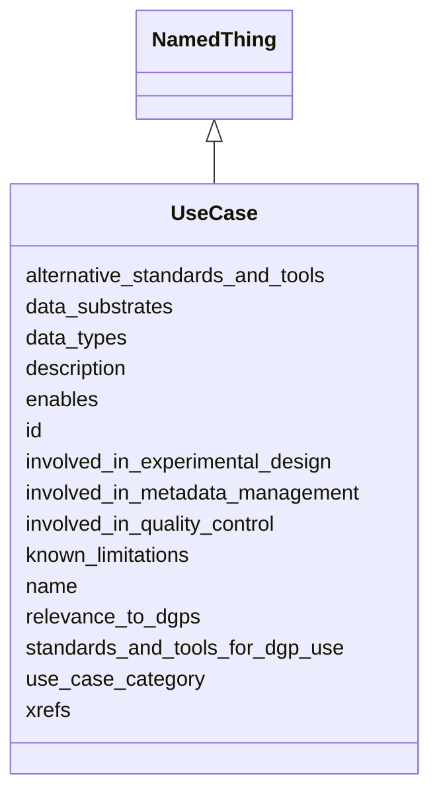

# Class: UseCase
_Represents a use case for Bridge2AI standards._


URI: [STANDARDSUSECASE:UseCase](https://w3id.org/bridge2ai/standards-usecase-schema/UseCase)





## Inheritance
* [NamedThing](NamedThing.md)
    * **UseCase**


## Slots

| Name | Cardinality and Range | Description | Inheritance |
| ---  | --- | --- | --- |
| [use_case_category](use_case_category.md) | 0..1 <br/> [UseCaseCategory](UseCaseCategory.md) | Category of the UseCase | direct |
| [known_limitations](known_limitations.md) | 0..1 <br/> [xsd:string](xsd:string) | Any current obstacles to implementing this use case | direct |
| [relevance_to_dgps](relevance_to_dgps.md) | 0..1 <br/> [DataGeneratingProject](DataGeneratingProject.md) | Relevance of the use case to one or more DGPs | direct |
| [data_types](data_types.md) | 0..1 <br/> NONE |  | direct |
| [data_substrates](data_substrates.md) | 0..1 <br/> NONE |  | direct |
| [standards_and_tools_for_dgp_use](standards_and_tools_for_dgp_use.md) | 0..1 <br/> NONE |  | direct |
| [alternative_standards_and_tools](alternative_standards_and_tools.md) | 0..1 <br/> NONE |  | direct |
| [enables](enables.md) | 0..1 <br/> NONE |  | direct |
| [involved_in_experimental_design](involved_in_experimental_design.md) | 0..1 <br/> NONE |  | direct |
| [involved_in_metadata_management](involved_in_metadata_management.md) | 0..1 <br/> NONE |  | direct |
| [involved_in_quality_control](involved_in_quality_control.md) | 0..1 <br/> NONE |  | direct |
| [xrefs](xrefs.md) | 0..1 <br/> NONE |  | direct |
| [name](name.md) | 0..1 <br/> NONE | A human-readable name for a thing | [NamedThing](NamedThing.md) |
| [id](id.md) | 1..1 <br/> [xsd:anyURI](xsd:anyURI) | A unique identifier for a thing | [NamedThing](NamedThing.md) |
| [description](description.md) | 0..1 <br/> NONE | A human-readable description for a thing | [NamedThing](NamedThing.md) |


## Usages

| used by | used in | type | used |
| ---  | --- | --- | --- |
| [UseCaseCollection](UseCaseCollection.md) | [entries](entries.md) | range | [UseCase](UseCase.md) |


## Identifier and Mapping Information


### Schema Source


* from schema: https://w3id.org/bridge2ai/standards-usecase-schema


## Mappings

| Mapping Type | Mapped Value |
| ---  | ---  |
| self | STANDARDSUSECASE:UseCase |
| native | STANDARDSUSECASE:UseCase |


## LinkML Source

<!-- TODO: investigate https://stackoverflow.com/questions/37606292/how-to-create-tabbed-code-blocks-in-mkdocs-or-sphinx -->

### Direct

<details>
```yaml
name: UseCase
description: Represents a use case for Bridge2AI standards.
from_schema: https://w3id.org/bridge2ai/standards-usecase-schema
rank: 1000
is_a: NamedThing
slots:
- use_case_category
- known_limitations
- relevance_to_dgps
- data_types
- data_substrates
- standards_and_tools_for_dgp_use
- alternative_standards_and_tools
- enables
- involved_in_experimental_design
- involved_in_metadata_management
- involved_in_quality_control
- xrefs

```
</details>

### Induced

<details>
```yaml
name: UseCase
description: Represents a use case for Bridge2AI standards.
from_schema: https://w3id.org/bridge2ai/standards-usecase-schema
rank: 1000
is_a: NamedThing
attributes:
  use_case_category:
    name: use_case_category
    description: Category of the UseCase. Not all projects will incorporate use cases
      in all categories.
    from_schema: https://w3id.org/bridge2ai/standards-usecase-schema
    rank: 1000
    alias: use_case_category
    owner: UseCase
    domain_of:
    - UseCase
    range: UseCaseCategory
  known_limitations:
    name: known_limitations
    description: Any current obstacles to implementing this use case. This could be
      a selection from one or more predefined categories including lack of standards,
      lack of relevant patient cohort, lack of funding, etc.
    from_schema: https://w3id.org/bridge2ai/standards-usecase-schema
    rank: 1000
    alias: known_limitations
    owner: UseCase
    domain_of:
    - UseCase
    range: string
  relevance_to_dgps:
    name: relevance_to_dgps
    description: Relevance of the use case to one or more DGPs.
    from_schema: https://w3id.org/bridge2ai/standards-usecase-schema
    rank: 1000
    alias: relevance_to_dgps
    owner: UseCase
    domain_of:
    - UseCase
    range: DataGeneratingProject
  data_types:
    name: data_types
    from_schema: https://w3id.org/bridge2ai/standards-usecase-schema
    rank: 1000
    alias: data_types
    owner: UseCase
    domain_of:
    - UseCase
    range: string
  data_substrates:
    name: data_substrates
    from_schema: https://w3id.org/bridge2ai/standards-usecase-schema
    rank: 1000
    alias: data_substrates
    owner: UseCase
    domain_of:
    - UseCase
    range: string
  standards_and_tools_for_dgp_use:
    name: standards_and_tools_for_dgp_use
    from_schema: https://w3id.org/bridge2ai/standards-usecase-schema
    rank: 1000
    alias: standards_and_tools_for_dgp_use
    owner: UseCase
    domain_of:
    - UseCase
    range: string
  alternative_standards_and_tools:
    name: alternative_standards_and_tools
    from_schema: https://w3id.org/bridge2ai/standards-usecase-schema
    rank: 1000
    alias: alternative_standards_and_tools
    owner: UseCase
    domain_of:
    - UseCase
    range: string
  enables:
    name: enables
    from_schema: https://w3id.org/bridge2ai/standards-usecase-schema
    rank: 1000
    alias: enables
    owner: UseCase
    domain_of:
    - UseCase
    range: string
  involved_in_experimental_design:
    name: involved_in_experimental_design
    from_schema: https://w3id.org/bridge2ai/standards-usecase-schema
    rank: 1000
    alias: involved_in_experimental_design
    owner: UseCase
    domain_of:
    - UseCase
    range: string
  involved_in_metadata_management:
    name: involved_in_metadata_management
    from_schema: https://w3id.org/bridge2ai/standards-usecase-schema
    rank: 1000
    alias: involved_in_metadata_management
    owner: UseCase
    domain_of:
    - UseCase
    range: string
  involved_in_quality_control:
    name: involved_in_quality_control
    from_schema: https://w3id.org/bridge2ai/standards-usecase-schema
    rank: 1000
    alias: involved_in_quality_control
    owner: UseCase
    domain_of:
    - UseCase
    range: string
  xrefs:
    name: xrefs
    from_schema: https://w3id.org/bridge2ai/standards-usecase-schema
    rank: 1000
    alias: xrefs
    owner: UseCase
    domain_of:
    - UseCase
    range: string
  id:
    name: id
    description: A unique identifier for a thing
    from_schema: https://w3id.org/bridge2ai/standards-usecase-schema
    rank: 1000
    slot_uri: schema:identifier
    identifier: true
    alias: id
    owner: UseCase
    domain_of:
    - NamedThing
    range: uriorcurie
  name:
    name: name
    description: A human-readable name for a thing
    from_schema: https://w3id.org/bridge2ai/standards-usecase-schema
    rank: 1000
    slot_uri: schema:name
    alias: name
    owner: UseCase
    domain_of:
    - NamedThing
    range: string
  description:
    name: description
    description: A human-readable description for a thing
    from_schema: https://w3id.org/bridge2ai/standards-usecase-schema
    rank: 1000
    slot_uri: schema:description
    alias: description
    owner: UseCase
    domain_of:
    - NamedThing
    range: string

```
</details>