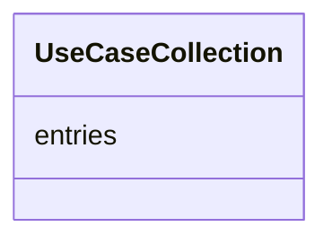

# Class: UseCaseCollection
_A holder for UseCase objects_


URI: [STANDARDSUSECASE:UseCaseCollection](https://w3id.org/bridge2ai/standards-usecase-schema/UseCaseCollection)





<!-- no inheritance hierarchy -->


## Slots

| Name | Cardinality and Range | Description | Inheritance |
| ---  | --- | --- | --- |
| [entries](entries.md) | 0..* <br/> [UseCase](UseCase.md) |  | direct |


## Identifier and Mapping Information


### Schema Source


* from schema: https://w3id.org/bridge2ai/standards-usecase-schema


## Mappings

| Mapping Type | Mapped Value |
| ---  | ---  |
| self | STANDARDSUSECASE:UseCaseCollection |
| native | STANDARDSUSECASE:UseCaseCollection |


## LinkML Source

<!-- TODO: investigate https://stackoverflow.com/questions/37606292/how-to-create-tabbed-code-blocks-in-mkdocs-or-sphinx -->

### Direct

<details>
```yaml
name: UseCaseCollection
description: A holder for UseCase objects
from_schema: https://w3id.org/bridge2ai/standards-usecase-schema
rank: 1000
attributes:
  entries:
    name: entries
    from_schema: https://w3id.org/bridge2ai/standards-usecase-schema
    rank: 1000
    multivalued: true
    range: UseCase
    inlined: true
tree_root: true

```
</details>

### Induced

<details>
```yaml
name: UseCaseCollection
description: A holder for UseCase objects
from_schema: https://w3id.org/bridge2ai/standards-usecase-schema
rank: 1000
attributes:
  entries:
    name: entries
    from_schema: https://w3id.org/bridge2ai/standards-usecase-schema
    rank: 1000
    multivalued: true
    alias: entries
    owner: UseCaseCollection
    domain_of:
    - UseCaseCollection
    range: UseCase
    inlined: true
tree_root: true

```
</details>